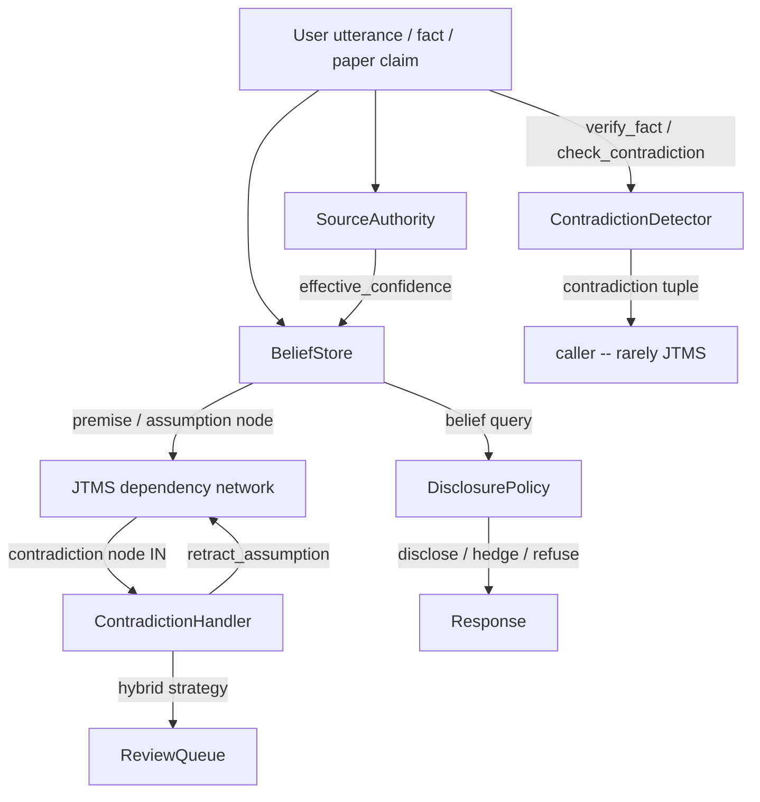
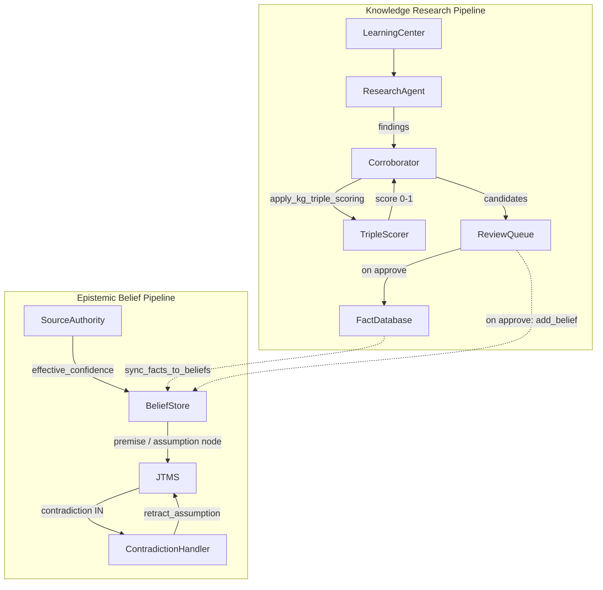

# JTMS Truth-Discernment Audit

**Date:** 2026-04-21
**Scope:** Full taxonomy of truth/lie discernment in the epistemic layer

---

## 1. Executive Summary

The JTMS (Justification-based Truth Maintenance System) does **not** determine truth. It propagates IN/OUT labels through a dependency graph. "Truth" in this codebase is decided by a **stack of four loosely coupled layers**, only one of which (the academic-paper builder) ever closes the loop back into the JTMS for world-fact contradictions.

**Most critical finding:** A user statement tagged `:explicit` becomes a JTMS `:premise` (always IN, never retractable), so a confidently-asserted user lie is currently treated as axiomatic truth. See:

- `BeliefStore.maybe_create_jtms_node/1` at `apps/brain/lib/brain/epistemic/belief_store.ex` lines 575-599 -- `:explicit` source maps to `JTMS.create_premise/2`
- `Node.initial_label(:premise, _)` at `apps/brain/lib/brain/epistemic/types.ex` lines 182-184 -- premises are unconditionally labeled `:in`

The system has **no concept of "lie"** as a first-class entity. It relies on confidence levels, source authority, and token-level contradiction detection to approximate truth discernment. Of the four lie categories audited, only one (low-credibility source) passes end-to-end.

### Scorecard

| Category | Verdict |
|---|---|
| 4a. Contradicts curated fact (axiomatic violation) | **Fail (silent)** |
| 4b. Lower authority contradicts higher authority | **Partial** |
| 4c. User self-contradiction | **Fail** |
| 4d. Low-credibility source | **Pass** |

---

## 2. What Makes Up the JTMS -- The Four-Layer Truth Stack

### Architecture diagram



### Component breakdown

#### Layer 1: JTMS core

**File:** `apps/brain/lib/brain/epistemic/jtms.ex`

A GenServer implementing classic Forbus & de Kleer label propagation. Has **no opinion about world truth** -- only IN/OUT bookkeeping.

**Public API:**
- `create_premise/2` -- creates a node that is always IN (line 26)
- `create_assumption/3` -- creates a toggleable node (line 31)
- `create_contradiction/2` -- creates a marker node that triggers the handler when IN (line 39)
- `justify_node/4` -- links premise nodes to a conclusion via in_list/out_list (line 44)
- `enable_assumption/1`, `retract_assumption/1` -- toggle assumption labels, trigger propagation (lines 60, 65)
- `register_contradiction/2` -- marks a set of node IDs as mutually contradictory (line 100)
- `check_consistency/0` -- returns `{:ok, :consistent}` or `{:error, {:contradiction, node_id}}` (line 105)
- `why_node/1` -- returns the justification chain explaining why a node is IN (line 85)

**Label propagation** (lines 435-507):
- A justification is "valid" when all `in_list` nodes are `:in` AND all `out_list` nodes are `:out` (`Justification.valid?/2` at `types.ex` lines 237-249).
- When a justification becomes valid, its conclusion node transitions from `:out` to `:in`.
- When a justification is invalidated, if the conclusion is `:derived` and has no other valid justification, it transitions to `:out`.
- Propagation cascades: changing one node's label re-evaluates all justifications that reference it.

**Contradiction handling** (lines 529-540): When a contradiction node becomes `:in`, the registered handler callback is invoked with `{:contradiction, node_id, supporting_assumptions}`. The default handler logs a warning. The `ContradictionHandler` GenServer replaces this with its own callback during init.

#### Layer 2: Node types and justifications

**File:** `apps/brain/lib/brain/epistemic/types.ex`

**Node types** (lines 107-201):

| Type | Initial label | Retractable? | Purpose |
|---|---|---|---|
| `:premise` | Always `:in` | No | Axiomatic truths, curated facts, explicit user statements |
| `:assumption` | `:in` if enabled, else `:out` | Yes | Inferred/learned beliefs, toggleable hypotheses |
| `:derived` | `:out` until justified | N/A (follows justifications) | Conclusions derived from other nodes |
| `:contradiction` | `:out` | N/A | Marker that fires the handler when driven `:in` |

**Justification validity** (lines 237-249):
```
valid? = all(in_list nodes are :in) AND all(out_list nodes are :out)
```

**Belief struct** (lines 4-105): Tracks `subject/predicate/object` triple, `confidence` (0.0-1.0), `source` (`:explicit | :inferred | :assumed | :default | :learned | :consolidated | :curated_fact`), `source_authority` (atom), `provenance` (list), `volatility`, `last_confirmed`, and `node_id` linking to JTMS.

#### Layer 3: Belief layer

**File:** `apps/brain/lib/brain/epistemic/belief_store.ex`

The wrapper that turns a `%Belief{}` into a JTMS node and manages the lifecycle.

**Key function -- `maybe_create_jtms_node/1`** (lines 575-599):

```elixir
case source do
  :explicit ->
    JTMS.create_premise(datum)          # Always IN, never retractable
  _ ->
    JTMS.create_assumption(datum, true) # Retractable assumption, starts IN
end
```

This is the single most consequential design decision in the truth stack. It means:
- Every user statement extracted as `:explicit` becomes an irrevocable premise.
- The JTMS cannot retract it, even if it contradicts a curated fact.

**Confidence decay** (lines 491-567): Runs on a timer (`decay_interval_ms`, default 1 hour). Reduces confidence by `decay_rate` (default 5%) per tick for beliefs older than `decay_min_age_ms` (default 24 hours). **Exempt sources:** `:explicit`, `:learned`, `:curated_fact` (defined at `types.ex` line 518). This means user lies tagged `:explicit` never decay.

**Authority-aware beliefs** (lines 200-236): `add_belief_with_authority/5` queries `SourceAuthority.effective_confidence/1` to set the initial confidence before calling `add_belief/1`.

#### Layer 4: Source authority

**File:** `apps/brain/lib/brain/epistemic/source_authority.ex`
**Config:** `apps/brain/priv/knowledge/source_authority_profiles.json`

Defines trust profiles for different information sources. Each profile specifies:

| Authority | Initial Confidence | Decay Multiplier | JTMS Node Type | Credibility Floor |
|---|---|---|---|---|
| `curated_fact` | 1.00 | 0.0x | premise | 1.0 |
| `academic_expert` | 0.90 | 0.3x | assumption | 0.4 |
| `mentor` | 0.85 | 0.5x | assumption | 0.3 |
| `industry_expert` | 0.85 | 0.4x | assumption | 0.35 |
| `postgraduate` | 0.75 | 0.6x | assumption | 0.25 |
| `friend` | 0.70 | 0.6x | assumption | 0.25 |
| `hobbyist` | 0.65 | 0.7x | assumption | 0.2 |
| `student` | 0.60 | 0.8x | assumption | 0.2 |
| `acquaintance` | 0.55 | 0.8x | assumption | 0.15 |
| `stranger` | 0.40 | 1.0x | assumption | 0.1 |
| `parody` | 0.05 | 2.0x | assumption | 0.0 |

**Effective confidence formula:**

```
effective_confidence = initial_confidence * current_credibility
```

where `current_credibility = max(confirmed / (confirmed + contradicted), credibility_floor)`.

Credibility is tracked dynamically via `record_outcome/2` (`:confirmed` or `:contradicted` cast events). Only `curated_fact` uses `:premise` node type; all others are `:assumption`.

### Supporting modules

#### Contradiction detector

**File:** `apps/brain/lib/brain/knowledge/contradiction_detector.ex`

The only oracle for "do these two texts contradict each other?" Uses three checks:

1. **Negation difference** (lines 31-39): Tokenizes both texts, checks if exactly one contains negation words.
2. **Number disagreement** (lines 55-72): Extracts numeric tokens, checks if corresponding numbers differ by > 20%.
3. **`is`/`is not` pattern** (lines 116-131): Checks if one text has `"is"` without `"not"` and the other has `"is"` with `"not"`.

**Does NOT detect:** entity substitution ("Paris" vs "London"), paraphrased opposites ("hot" vs "cold" without "is"), pronoun swap, semantic contradiction without explicit negation markers.

#### Contradiction handler

**File:** `apps/brain/lib/brain/epistemic/contradiction_handler.ex`

Receives JTMS contradiction callbacks and applies resolution strategies:

- `:auto_least_confident` -- retract the assumption with lowest confidence (lines 310-323)
- `:auto_most_recent` -- retract the most recently created assumption (lines 325-338)
- `:manual` -- always queue for user input (line 340)
- `:hybrid` (default) -- auto-retract if confidence delta > 0.3, otherwise queue (lines 344-362)

Built-in domain rules:
- `knowledge_expansion` -- queues new fact vs existing belief to `ReviewQueue` (lines 203-219)
- `academic_papers` -- resolves by citation count when one paper has > 2x citations (lines 240-298)

#### Fact database integration

**File:** `apps/brain/lib/brain/fact_database/integration.ex`

Provides the public truth-test entry points:

- `verify_fact/2` (lines 56-76): Queries BeliefStore for same subject+predicate, checks for contradictions via `ContradictionDetector`, returns `{:verified, confidence}`, `{:contradicted, beliefs}`, or `{:uncertain, reason}`.
- `check_contradiction/2` (lines 182-199): Similar but returns `:consistent`, `{:contradiction, beliefs}`, or `:no_data`.
- `sync_facts_to_beliefs/1` (lines 90-111): Curated facts become premises (confidence 1.0, immutable); learned facts >= 0.9 become premises, others become assumptions.

#### Knowledge graph triple scorer

**File:** `apps/brain/lib/brain/ml/knowledge_graph/triple_scorer.ex`
**Related:** `apps/brain/lib/brain/ml/knowledge_graph/embedder.ex`

A BiLSTM neural network that scores knowledge graph triples `(head, relation, tail)` for plausibility. Given a triple like `("Paris", "capital_of", "France")`, it returns a score between 0 and 1 indicating how likely the triple is valid. Trained via negative sampling: positive triples from the knowledge graph, negatives generated by corrupting head or tail entities.

**Architecture** (lines 7-9):
```
Input: "[HEAD] entity [REL] relation [TAIL] entity"
  -> Tokenize -> Embedding -> BiLSTM -> Masked mean pool
  -> Dense(128, ReLU) -> Dropout -> Dense(1) -> Sigmoid
```

**Public API:**
- `score/3` -- returns `{:ok, score}` where score is in (0, 1); higher = more likely valid (line 53)
- `score_batch/1` -- scores multiple triples (line 66)
- `ready?/0` -- follows the project's standard readiness check pattern (line 39)

**Relationship to the JTMS and belief system:**

The Triple Scorer and the JTMS operate on **completely separate pipelines** with no direct connection:



The Triple Scorer has exactly **one production caller**: `Corroborator.apply_kg_triple_scoring/2` at `apps/brain/lib/brain/knowledge/corroborator.ex` line 375. It blends the triple score into the corroboration aggregate confidence with a 70/30 weight (lines 375-384):

```elixir
adjusted = aggregate * 0.7 + score * 0.3
```

This happens during knowledge research -- the LearningCenter gathers findings from multiple sources, and the Corroborator evaluates cross-source agreement. The triple scorer adds a "does this claim fit the existing knowledge graph structure?" signal. The only other reference is a feature flag at `brain.ex` line 1559 (`kg_lstm_available: TripleScorer.ready?()`), which records whether the model is loaded but does not feed into JTMS or beliefs.

**The overlap is indirect and one-directional**, flowing through the BeliefStore:

1. **TripleScorer -> Corroborator -> ReviewQueue -> BeliefStore**: When a research candidate is approved, the ReviewQueue calls `BeliefStore.add_belief/4` (at `review_queue.ex` lines 691-699). The triple score influenced whether the candidate's aggregate confidence was high enough to be approved, but the score itself is not stored on the resulting belief.

2. **BeliefStore -> JTMS**: When that belief is added, `maybe_create_jtms_node/1` creates a JTMS node. But the JTMS node has no link back to the triple score that contributed to its existence.

The triple score is consumed, blended into an aggregate, and then lost. By the time a fact reaches the BeliefStore (if it gets approved), the confidence is a flat number with no record of the triple scorer's contribution. The JTMS never queries the Triple Scorer to validate existing nodes or new justifications. The ContradictionDetector (the JTMS's "truth oracle") could benefit from the scorer's learned embeddings to detect semantic contradictions, but does not use them.

The Embedder module (`apps/brain/lib/brain/ml/knowledge_graph/embedder.ex`) extracts 128-dimensional entity embeddings from the trained scorer's `dense1` layer. These embeddings capture relational context from the knowledge graph and could be used for entity similarity or belief enrichment, but currently have no consumers in the epistemic pipeline.

#### Disclosure policy

**File:** `apps/brain/lib/brain/epistemic/disclosure_policy.ex`

Gates what the system will actually say based on belief confidence and source:
- `>= 0.8` explicit: disclose freely (line 57)
- `>= 0.8` inferred: disclose with light hedging (line 60)
- `0.6-0.8`: light hedging (line 54)
- `< 0.6`: strong hedging (line 51)
- `< 0.3`: refuse to disclose (line 38)

---

## 3. What the System Actually Uses to Determine "Truth"

The system has no single "truth" predicate. Instead, "truth" is an emergent property of four independent mechanisms:

### 3.1 Axiomatic truth

**Definition:** A `curated_fact` with `source_authority: :curated_fact` synced via `FactDatabase.Integration.sync_fact_to_belief/2` (lines 113-145).

**Properties:**
- JTMS node type: `:premise` (always IN)
- Confidence: 1.0
- Decay rate multiplier: 0.0 (never decays)
- Credibility floor: 1.0 (cannot be degraded by contradictions)
- Metadata flag: `immutable: true`
- Source: `:curated_fact` (in `decay_exempt_sources`)

**Who creates these:** The `sync_facts_to_beliefs/1` function during fact database initialization; curated facts from JSON files in `apps/brain/priv/knowledge/`.

### 3.2 Verified truth

**Definition:** A fact for which `Integration.verify_fact/2` returns `{:verified, confidence}`.

**Mechanism** (at `integration.ex` lines 56-76):
1. Query BeliefStore for beliefs matching `subject: :world, predicate: normalize_entity(entity)`.
2. Check each existing belief against the new fact using `ContradictionDetector.contradicts?/2`.
3. If contradictions found: return `{:contradicted, conflicting_beliefs}`.
4. If no contradictions, find the highest-confidence belief via `Enum.max_by`.
5. If `max_confidence >= 0.7`: return `{:verified, confidence}`.
6. Otherwise: return `{:uncertain, :low_confidence}`.

**Threshold:** 0.7 confidence (hardcoded at line 66).

### 3.3 Confidence-as-truth

**Definition:** The effective confidence score from `SourceAuthority.effective_confidence/1` determines how much the system trusts a belief for downstream decisions.

**Formula:** `initial_confidence * max(confirmed / total_outcomes, credibility_floor)`

This is not a binary truth value but a continuous signal that influences:
- Whether `verify_fact/2` returns `:verified` vs `:uncertain`
- What hedging level `DisclosurePolicy.evaluate_disclosure/2` applies
- How fast the belief decays (via `effective_decay_rate`)

### 3.4 Negative truth (contradiction detection)

**Definition:** `ContradictionDetector.contradicts?/2` returns `true` for:
1. Negation difference: exactly one text contains negation tokens (lines 31-39)
2. Number disagreement: corresponding numbers differ by > 20% (lines 55-72)
3. `is`/`is not` opposition: one has `"is"` without `"not"`, other has both (lines 116-131)

**Limitations:**
- Cannot detect entity substitution: `"The capital is Paris"` vs `"The capital is London"` returns `false` (no negation, no numbers, no `is not` pattern).
- Cannot detect paraphrased opposites: `"It is hot"` vs `"It is cold"` returns `false` unless one uses an explicit negation word.
- Cannot detect semantic implication conflicts: `"Socrates is alive"` vs `"Socrates died in 399 BC"` returns `false`.

---

## 4. Lie-Discernment Audit -- Four Categories

### 4a. Lie That Contradicts a Curated Fact (Axiomatic-Truth Violation)

**Scenario:** A curated fact states "The capital of France is Paris." A user says "Paris is not the capital of France."

**Code path:**
1. User utterance enters `Brain.evaluate/3`.
2. Belief extraction creates a belief with `source: :explicit` (at `brain.ex` lines 2129-2132 and 2344-2347).
3. `BeliefStore.add_belief/1` stores the belief and calls `maybe_create_jtms_node/1` (at `belief_store.ex` line 297).
4. Since `source == :explicit`, the node is created as a `:premise` via `JTMS.create_premise/2` (at `belief_store.ex` line 583).
5. The premise is labeled `:in` unconditionally (at `types.ex` line 183).

**What does NOT happen:**
- `Integration.verify_fact/2` is never called from the belief-add path. Grepping for callers of `verify_fact` shows only tests and `paper_model_builder`.
- `Integration.check_contradiction/2` is also not called from this path.
- `JTMS.register_contradiction/2` is not called. The new premise and the existing curated-fact premise are both `:in` but the JTMS has no way to know they conflict -- no contradiction node links them.
- Only `paper_model_builder.ex` (lines 251-266) wires `register_contradiction` for academic paper claims. No equivalent exists for user-belief or learned-fact paths.

**Result:** The lying premise is added alongside the truth premise. Both are labeled IN. JTMS reports `{:ok, :consistent}` because no contradiction node was ever created. The lie persists indefinitely (`:explicit` is in `decay_exempt_sources`).

**Verdict:** **Fail (silent).** The system cannot distinguish the lie from the truth.

---

### 4b. Lie That Contradicts a Higher-Authority Belief

**Scenario:** A mentor-authority belief states "Elixir runs on the BEAM." A stranger-authority belief is added claiming the opposite.

**Code path:**
1. `BeliefStore.add_belief_with_authority(:world, :elixir, "Elixir does not run on the BEAM", :stranger)` (at `belief_store.ex` lines 200-236).
2. `SourceAuthority.effective_confidence(:stranger)` returns ~0.40 (at `source_authority.ex` lines 142-150).
3. The belief is stored with confidence 0.40.
4. `maybe_create_jtms_node/1` creates a `:assumption` node (source is `:explicit` from `add_belief_with_authority` merged opts, so it actually becomes a premise -- see gap below).

**What works:**
- The stranger belief has low confidence (0.40), so `verify_fact/2` returns `{:uncertain, :low_confidence}` (verified by `authority_impact_test.exs` lines 30-78).
- `DisclosurePolicy.evaluate_disclosure/2` applies strong hedging or refuses to disclose at confidence < 0.6.

**What does NOT work:**
- The lie is still stored as a belief in the BeliefStore. No JTMS contradiction node links it to the mentor's belief.
- No automatic credibility hit fires on the stranger unless the belief is later explicitly retracted (which requires external action).
- If the stranger belief were stored with `source: :explicit` (the default from `add_belief_with_authority`), it becomes an irrevocable JTMS premise despite the low confidence.
- The system will not detect this as a "lie" -- only as "uncertain." The distinction matters: an uncertain belief could later be confirmed, while a lie should be flagged.

**Verdict:** **Partial.** Disclosure-time hedging provides a soft safety net, but the lie is persisted without being identified as contradictory to a trusted source.

---

### 4c. User Self-Contradiction (User Changes Their Story)

**Scenario:** User says "I'm from New York." Later, same user says "Actually, I'm from Chicago."

**Code path:**
1. First utterance: belief extracted with `source: :explicit`, predicate `:location`, object `"New York"`, stored via `BeliefStore.add_belief/1` -> JTMS premise.
2. Second utterance: belief extracted with `source: :explicit`, predicate `:location`, object `"Chicago"`, stored via `BeliefStore.add_belief/1` -> JTMS premise.
3. Both premises are labeled `:in`.

**What does NOT happen:**
- `BeliefStore.add_belief/1` does not check for existing beliefs with the same `subject + predicate` before adding.
- `ContradictionDetector.contradicts?("New York", "Chicago")` would return `false` -- no negation, no numbers, no `is`/`is not` pattern. Even if the detector were called, it wouldn't catch this.
- No `JTMS.register_contradiction/2` call links the two location beliefs.

**Test evidence:**
- `contradiction_handling_test.exs` lines 272-315 tests exactly this scenario.
- The test asserts that the second belief (Chicago) exists -- it does **not** assert that the first (New York) was retracted or flagged.
- `query_beliefs(subject: :user, predicate: :location, user_id: user_id)` returns both beliefs.
- The test codifies the gap as expected behavior: the system silently holds contradictory premises.

**Decay won't help:** `:explicit` is in `decay_exempt_sources` (`types.ex` line 518), so neither belief will ever decay. Both persist indefinitely.

**Verdict:** **Fail.** The JTMS holds two contradictory premises silently. The system cannot identify that the user changed their story.

---

### 4d. Low-Credibility Source (Parody / Repeatedly-Contradicted Authority)

**Scenario:** A parody source asserts "Gravity pulls things down." Or: a mentor's credibility is eroded by repeated contradictions.

**Code path:**
1. `SourceAuthority.effective_confidence(:parody)` returns ~0.05 (initial 0.05 * credibility 1.0).
2. `BeliefStore.add_belief_with_authority(:world, :gravity, "Gravity pulls things down", :parody)` stores the belief with confidence ~0.05.
3. `verify_fact("gravity", "Gravity pulls things down")` returns `{:uncertain, :low_confidence}` because 0.05 < 0.7.

**What works:**
- Confidence math is correct and well-tested (`source_authority_test.exs` lines 105-173, `authority_impact_test.exs` lines 222-281).
- Credibility floors are enforced: mentor never drops below 0.3, parody can reach 0.0.
- Even with 100% confirmed credibility, parody effective confidence stays at 0.05 (tested at `authority_impact_test.exs` lines 288-335).
- Decay rate multiplier is 2.0x for parody, so beliefs decay twice as fast.
- `DisclosurePolicy` will refuse to disclose beliefs with confidence < 0.3.

**What works for degraded authorities:**
- After 8 contradictions + 2 confirmations, mentor credibility = max(2/10, 0.3) = 0.3.
- Effective confidence = 0.85 * 0.3 = 0.255, well below the 0.7 verification threshold.
- New beliefs from the degraded mentor will not reach `:verified` status.
- Credibility can recover with subsequent confirmed outcomes (tested at `authority_impact_test.exs` lines 257-281).

**Verdict:** **Pass.** This is the only category the system handles reliably end-to-end. The confidence hierarchy, credibility tracking, decay rates, and disclosure gating all work together correctly.

---

## 5. Concrete Gaps

### Gap 1: No automatic contradiction check on belief addition

**Location:** `apps/brain/lib/brain/epistemic/belief_store.ex` lines 290-318 (`handle_call({:add_belief, belief}, ...)`)

`BeliefStore.add_belief/1` does not call `ContradictionDetector.contradicts?/2` or `JTMS.register_contradiction/2`. There is no automatic detection of conflicts between a new belief and existing beliefs of the same `subject + predicate`. Beliefs are stored unconditionally.

### Gap 2: Explicit user statements become irrevocable premises

**Location:** `apps/brain/lib/brain/epistemic/belief_store.ex` lines 575-599 (`maybe_create_jtms_node/1`)

User input tagged `:explicit` (the most common source for user-originated beliefs) becomes a JTMS `:premise`, which is unconditionally labeled `:in` and cannot be retracted. This defeats the core value proposition of a Truth Maintenance System: the ability to retract beliefs when evidence changes. Explicit user statements should arguably be `:assumption` nodes, just as every other authority level (except `curated_fact`) uses `:assumption`.

### Gap 3: Explicit and learned beliefs never decay

**Location:** `apps/brain/lib/brain/epistemic/types.ex` line 518 (`decay_exempt_sources: [:explicit, :learned, :curated_fact]`)

The `decay_exempt_sources` list includes `:explicit` and `:learned`. This means even unconfirmed lies stored as explicit user statements never lose confidence over time. Only `:curated_fact` should arguably be exempt -- other sources should be subject to decay to allow the system to naturally forget low-quality information.

### Gap 4: ContradictionDetector cannot detect entity substitution

**Location:** `apps/brain/lib/brain/knowledge/contradiction_detector.ex` lines 80-88 (`contradicts?/2`)

The detector only checks for negation token differences, numeric disagreements, and `is`/`is not` patterns. It cannot detect:
- Entity substitution: `"The capital is Paris"` vs `"The capital is London"` -- returns `false`.
- Paraphrased opposites: `"It is hot"` vs `"It is cold"` -- returns `false` (no negation word).
- Semantic implication conflicts: `"Socrates is alive"` vs `"Socrates died in 399 BC"` -- returns `false`.

The test suite's "France/Paris" examples in `contradiction_handling_test.exs` only pass because they use the word "not" (e.g., `"The capital is not Paris"`), which triggers the negation difference check.

### Gap 5: verify_fact ignores internal disagreements

**Location:** `apps/brain/lib/brain/fact_database/integration.ex` lines 56-76 (`verify_fact/2`)

`verify_fact/2` short-circuits on the highest-confidence belief (`Enum.max_by(beliefs, & &1.confidence)`). It does not check whether multiple stored beliefs about the same subject already disagree with each other. A stored lie at confidence 0.6 next to truth at confidence 0.9 will return `{:verified, 0.9}` and the lie is invisible.

### Gap 6: Only paper_model_builder wires JTMS contradiction registration

**Location:** `apps/brain/lib/brain/knowledge/academic/paper_model_builder.ex` lines 251-266 (`register_contradiction/3`)

Only the academic paper model builder calls `JTMS.register_contradiction/2` for world-fact beliefs. The user-belief path (via `BeliefStore.add_belief/1`) and the learned-fact path (via `FactDatabase.Integration.add_fact/3`) do not wire contradiction registration. This means the JTMS contradiction handler and its resolution strategies (hybrid, auto-least-confident, etc.) are effectively dead code for non-academic contradictions.

### Gap 7: Self-contradiction tests codify the gap as expected behavior

**Location:** `apps/brain/test/brain/epistemic/contradiction_handling_test.exs` lines 272-315

The "handles contradiction when user changes their location" test asserts that the second belief (Chicago) exists, but does **not** assert that:
- The first belief (New York) was retracted or flagged
- A JTMS contradiction node was created
- `JTMS.check_consistency/0` returns an error

The test codifies the current behavior (silently holding contradictory premises) as passing, which means CI will not catch regressions toward truth maintenance.

### Gap 8: Knowledge Graph Triple Scorer is disconnected from truth maintenance

**Locations:**
- `apps/brain/lib/brain/ml/knowledge_graph/triple_scorer.ex` (the scorer itself)
- `apps/brain/lib/brain/knowledge/corroborator.ex` line 375 (only production caller)
- `apps/brain/lib/brain/epistemic/belief_store.ex` lines 290-318 (belief addition -- does not call scorer)
- `apps/brain/lib/brain/knowledge/contradiction_detector.ex` lines 80-88 (contradiction oracle -- does not call scorer)

The Triple Scorer is a trained BiLSTM that answers "does this triple fit the knowledge graph's learned relational structure?" -- a question directly relevant to truth maintenance. However:

1. **Not consulted during belief addition.** `BeliefStore.add_belief/1` does not call `TripleScorer.score/3` to validate whether a new belief is consistent with the knowledge graph before storing it or creating its JTMS node.

2. **Not used by ContradictionDetector.** The contradiction oracle uses only token-level heuristics (negation, numbers, `is`/`is not`). The Triple Scorer's learned embeddings could detect semantic contradictions that surface-level token checks miss (e.g., entity substitution), but the detector has no integration with the scorer.

3. **Score is discarded after corroboration.** When the Corroborator blends the triple score into its aggregate confidence (`aggregate * 0.7 + score * 0.3` at `corroborator.ex` line 379), the individual triple score is not preserved in the resulting ReviewCandidate or the downstream belief. There is no way to trace back which beliefs were supported or undermined by the knowledge graph.

4. **JTMS never queries the scorer.** The JTMS could use triple scores to set initial confidence on derived nodes, to weight justifications, or to validate new contradiction registrations. None of this happens.

5. **Embedder output is unused by the epistemic pipeline.** The Embedder (`apps/brain/lib/brain/ml/knowledge_graph/embedder.ex`) extracts 128-dim entity embeddings from the scorer, but no module in the epistemic layer (BeliefStore, JTMS, ContradictionDetector, ContradictionHandler) consumes these embeddings.

---

## 6. Suggested Verification Probes (For Future Work)

The following adversarial test seeds could form the basis of a truth-discernment test harness. Each probe is designed to fail against the current codebase and pass once the corresponding gap is fixed.

### Probe A: Curated fact violation

```elixir
test "user lie against curated fact triggers JTMS contradiction" do
  # Setup: load a curated fact as a premise
  {:ok, _} = FactDatabase.Integration.sync_facts_to_beliefs(layer: :curated)

  # Act: user asserts the opposite
  {:ok, _} = Brain.evaluate(conv_id, "Paris is not the capital of France", user_id: uid)

  # Assert: JTMS detected the contradiction
  assert {:error, {:contradiction, _}} = JTMS.check_consistency()
end
```

### Probe B: Authority hierarchy contradiction

```elixir
test "stranger belief that contradicts mentor triggers contradiction registration" do
  {:ok, _} = BeliefStore.add_belief_with_authority(:world, :elixir, "BEAM VM", :mentor)
  {:ok, _} = BeliefStore.add_belief_with_authority(:world, :elixir, "Not BEAM VM", :stranger)

  # Assert: contradiction was detected and registered
  contradictions = JTMS.get_contradictions()
  assert length(contradictions) >= 1
end
```

### Probe C: Self-contradiction retraction

```elixir
test "user self-contradiction retracts the older belief" do
  {:ok, _} = Brain.evaluate(conv_id, "I'm from New York", user_id: uid)
  {:ok, _} = Brain.evaluate(conv_id, "Actually, I'm from Chicago", user_id: uid)

  {:ok, beliefs} = BeliefStore.query_beliefs(subject: :user, predicate: :location, user_id: uid)

  # The old belief should be retracted or its confidence should be lowered
  ny_beliefs = Enum.filter(beliefs, &(&1.object == "New York"))
  assert ny_beliefs == [] or hd(ny_beliefs).confidence < 0.3
end
```

### Probe D: Entity substitution detection

```elixir
test "ContradictionDetector catches entity substitution" do
  assert ContradictionDetector.contradicts?(
    "The capital is Paris",
    "The capital is London"
  ) == true
end
```

### Probe E: Explicit belief should be retractable

```elixir
test "explicit user belief creates an assumption node, not a premise" do
  {:ok, belief_id} = BeliefStore.add_belief(:user, :location, "NYC", source: :explicit)
  {:ok, belief} = BeliefStore.get_belief(belief_id)
  {:ok, node} = JTMS.get_node(belief.node_id)

  # Explicit user statements should be retractable assumptions
  assert node.node_type == :assumption
end
```

### Probe F: Decay applies to explicit user beliefs

```elixir
test "explicit user beliefs are subject to confidence decay" do
  config = Brain.Epistemic.Types.Config.get()
  refute :explicit in config.decay_exempt_sources
end
```

### Probe G: Triple Scorer consulted during belief addition

```elixir
test "new belief is validated against knowledge graph before JTMS node creation" do
  # Setup: ensure TripleScorer is ready with a trained model
  assert TripleScorer.ready?()

  # Add a belief that contradicts the knowledge graph structure
  {:ok, belief_id} = BeliefStore.add_belief(:world, :france, "The capital is Berlin",
    source: :inferred, confidence: 0.7)

  {:ok, belief} = BeliefStore.get_belief(belief_id)

  # The belief's confidence should be adjusted downward by the triple scorer
  # since ("France", "capital", "Berlin") scores low in the knowledge graph
  assert belief.confidence < 0.7,
    "Expected triple scorer to lower confidence for graph-inconsistent belief"
end
```

### Probe H: ContradictionDetector uses embeddings for semantic contradiction

```elixir
test "ContradictionDetector catches entity substitution via knowledge graph embeddings" do
  # These share the same predicate structure but differ in the entity
  # Token-level checks would miss this, but embedding similarity should catch it
  assert ContradictionDetector.contradicts?(
    "The capital of France is Paris",
    "The capital of France is London"
  ) == true
end
```

---

## Appendix: File Index

| Module | File |
|---|---|
| JTMS core | `apps/brain/lib/brain/epistemic/jtms.ex` |
| Types (Node, Justification, Belief, Config) | `apps/brain/lib/brain/epistemic/types.ex` |
| BeliefStore | `apps/brain/lib/brain/epistemic/belief_store.ex` |
| SourceAuthority | `apps/brain/lib/brain/epistemic/source_authority.ex` |
| Source profiles JSON | `apps/brain/priv/knowledge/source_authority_profiles.json` |
| ContradictionDetector | `apps/brain/lib/brain/knowledge/contradiction_detector.ex` |
| ContradictionHandler | `apps/brain/lib/brain/epistemic/contradiction_handler.ex` |
| DisclosurePolicy | `apps/brain/lib/brain/epistemic/disclosure_policy.ex` |
| FactDatabase Integration | `apps/brain/lib/brain/fact_database/integration.ex` |
| Paper Model Builder | `apps/brain/lib/brain/knowledge/academic/paper_model_builder.ex` |
| KG Triple Scorer | `apps/brain/lib/brain/ml/knowledge_graph/triple_scorer.ex` |
| KG Embedder | `apps/brain/lib/brain/ml/knowledge_graph/embedder.ex` |
| Corroborator | `apps/brain/lib/brain/knowledge/corroborator.ex` |
| LearningCenter | `apps/brain/lib/brain/knowledge/learning_center.ex` |
| ReviewQueue | `apps/brain/lib/brain/knowledge/review_queue.ex` |
| JTMS tests | `apps/brain/test/brain/epistemic/jtms_test.exs` |
| Contradiction handling tests | `apps/brain/test/brain/epistemic/contradiction_handling_test.exs` |
| Source authority tests | `apps/brain/test/brain/epistemic/source_authority_test.exs` |
| Authority impact tests | `apps/brain/test/brain/epistemic/authority_impact_test.exs` |
