# ChatBot Architecture

This document provides a comprehensive visual guide to the ChatBot application's architecture, subsystems, and pipeline execution order.

## System Overview

The ChatBot is a **classical NLP chatbot** (no LLMs) built on several interconnected subsystems:

| Subsystem | Purpose |
|-----------|---------|
| **Analysis Pipeline** | Text understanding (chunking, discourse, speech acts, slots) |
| **Epistemic System** | Truth maintenance, beliefs, user models |
| **Memory System** | Episodic/semantic memory with consolidation |
| **Learning System** | Training worlds, entity discovery, heuristic learning |
| **Knowledge Expansion** | Web research, fact verification, admin review |
| **Response Generation** | Template-based, fact-based, memory-augmented responses |

## High-Level Overview

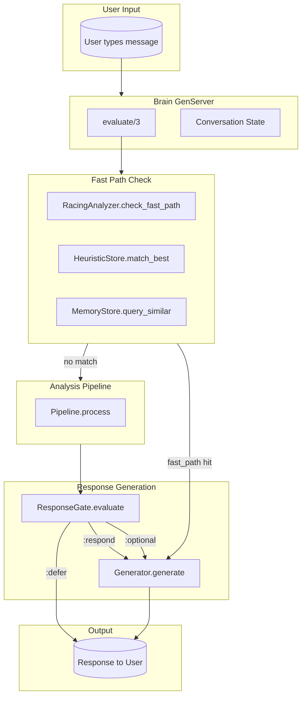

## Complete System Interaction Map

```mermaid
flowchart TB
    subgraph User["User Interface"]
        INPUT[("User Input")]
        OUTPUT[("Response")]
    end

    subgraph Core["Core Processing"]
        BRAIN["Brain<br/>(Orchestrator)"]
        PIPE["Pipeline<br/>(Analysis)"]
        RACE["RacingAnalyzer<br/>(Fast Path)"]
        GEN["Generator<br/>(Response)"]
    end

    subgraph Analysis["Analysis Components"]
        CHUNK["SemanticChunker"]
        DISC["DiscourseAnalyzer"]
        SPEECH["SpeechActClassifier"]
        SLOT["SlotDetector"]
        GATE["ResponseGate"]
        ANAPH["AnaphoraResolver"]
        FOLLOW["FollowupDetector"]
    end

    subgraph ML["ML Layer"]
        TOK["Tokenizer"]
        POS["POSTagger"]
        IC["IntentClassifier"]
        EE["EntityExtractor"]
        GAZ["Gazetteer"]
    end

    subgraph Memory["Memory System"]
        EMBED["Embedder"]
        MSTORE["Memory.Store"]
        CONSOL["Consolidation"]
        THINK["Think API"]
    end

    subgraph Epistemic["Epistemic System"]
        JTMS["JTMS"]
        BELIEF["BeliefStore"]
        UMODEL["UserModelStore"]
        CONTRA["ContradictionHandler"]
    end

    subgraph Learning["Learning System"]
        WORLD["WorldManager"]
        WCTX["WorldContext"]
        ENTDISC["EntityDiscoverer"]
        OUTCOME["OutcomeLearner"]
        HEUR["HeuristicStore"]
    end

    subgraph Knowledge["Knowledge Expansion"]
        LC["LearningCenter"]
        RA["ResearchAgent"]
        RQ["ReviewQueue"]
        SR["SourceReliability"]
    end

    subgraph Stores["Data Stores"]
        KS["KnowledgeStore"]
        FD["FactDatabase"]
        MS["MemoryStore"]
        TS["TemplateStore"]
    end

    %% Main flow
    INPUT --> BRAIN
    BRAIN --> RACE
    RACE -->|fast path| GEN
    RACE -->|no match| PIPE
    PIPE --> GATE
    GATE --> GEN
    GEN --> OUTPUT

    %% Analysis dependencies
    PIPE --> CHUNK
    PIPE --> DISC
    PIPE --> SPEECH
    PIPE --> SLOT
    PIPE --> ANAPH
    BRAIN --> FOLLOW
    SPEECH --> IC
    SLOT --> GAZ

    %% ML dependencies
    DISC --> TOK
    SPEECH --> TOK
    SPEECH --> POS
    EE --> TOK
    EE --> GAZ
    EE --> POS

    %% Memory usage
    RACE --> MSTORE
    SPEECH --> MSTORE
    BRAIN --> THINK
    THINK --> MSTORE
    MSTORE --> EMBED
    CONSOL --> MSTORE

    %% Epistemic usage
    BRAIN --> BELIEF
    BRAIN --> UMODEL
    JTMS --> CONTRA
    BELIEF --> JTMS
    SLOT --> UMODEL

    %% Learning usage
    BRAIN --> OUTCOME
    OUTCOME --> HEUR
    RACE --> HEUR
    WCTX --> WORLD
    ENTDISC --> WORLD
    WORLD --> GAZ

    %% Knowledge expansion
    LC --> RA
    RA --> RQ
    RQ --> BELIEF
    SR --> RA

    %% Response generation
    GEN --> TS
    GEN --> FD
    GEN --> MSTORE

    %% Learner
    BRAIN --> KS
    BRAIN --> MS

    style BRAIN fill:#f96,stroke:#333,stroke-width:4px
    style PIPE fill:#bbf,stroke:#333,stroke-width:2px
    style JTMS fill:#f9f,stroke:#333,stroke-width:2px
    style WORLD fill:#9f9,stroke:#333,stroke-width:2px
    style LC fill:#ff9,stroke:#333,stroke-width:2px
```

## Application Startup Order

The application starts processes in this order (defined in `application.ex`):

```mermaid
flowchart TD
    subgraph Core["Core Infrastructure"]
        T[ChatBotWeb.Telemetry]
        DNS[DNSCluster]
        PS[Phoenix.PubSub]
        REG[Registry - SubprocessRegistry]
    end

    subgraph ML["ML & Memory Layer"]
        MA[Metrics.Aggregator]
        IE[ML.InformalExpansions]
        GAZ[ML.Gazetteer]
        LS[Analysis.LearningStore]
        KS[KnowledgeStore]
        FD[FactDatabase]
        MS[MemoryStore]
        EMB[Memory.Embedder]
        STORE[Memory.Store]
    end

    subgraph Epistemic["Epistemic System"]
        JTMS[Epistemic.JTMS]
        BS[Epistemic.BeliefStore]
        UMS[Epistemic.UserModelStore]
        CH[Epistemic.ContradictionHandler]
    end

    subgraph Adaptive["Adaptive Processing"]
        AC[Analysis.AnalyzerCalibration]
        HS[Analysis.HeuristicStore]
        IC[ML.IntentClassifierSimple]
        WM[Learning.WorldManager]
        WMR[Learning.WorldModelRegistry]
        TS[Response.TemplateStore]
    end

    subgraph Knowledge["Knowledge Expansion"]
        ASV[Task.Supervisor - AgentSupervisor]
        SR[Knowledge.SourceReliability]
        RQ[Knowledge.ReviewQueue]
        LC[Knowledge.LearningCenter]
    end

    subgraph Main["Main Components"]
        BRAIN[ChatBot.Brain]
        EP[ChatBotWeb.Endpoint]
    end

    Core --> ML --> Epistemic --> Adaptive --> Knowledge --> Main

    style BRAIN fill:#f9f,stroke:#333,stroke-width:4px
    style PIPE fill:#bbf,stroke:#333,stroke-width:2px
```

## Brain.evaluate() Flow

This is the main entry point for processing user input:

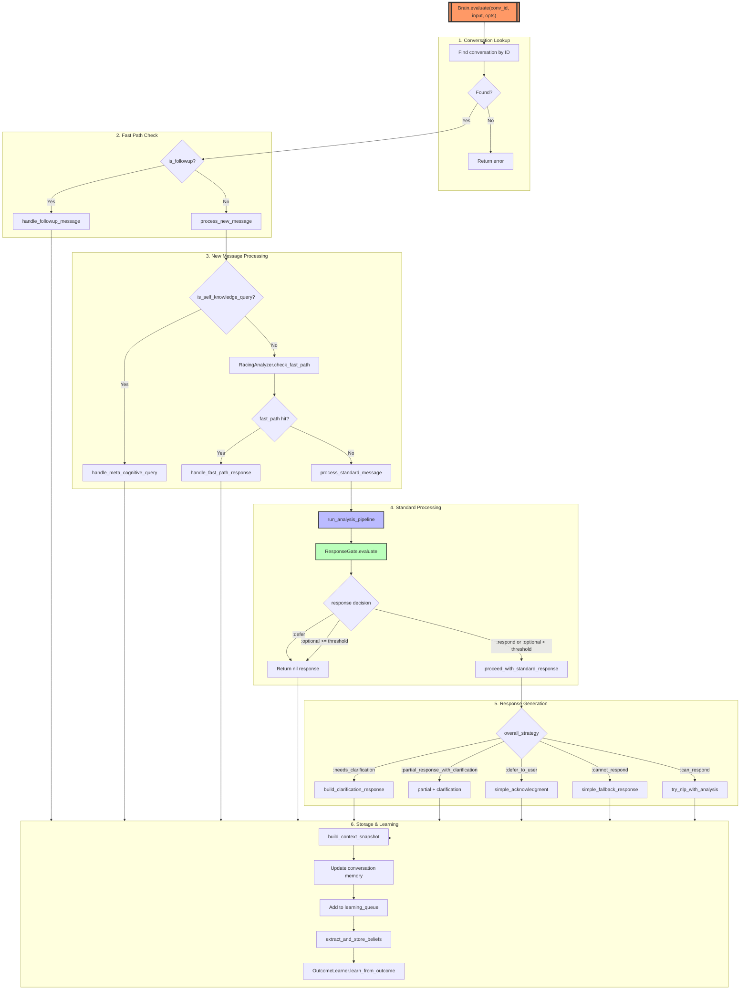

## Analysis Pipeline (Pipeline.process)

This is the core NLP processing pipeline:

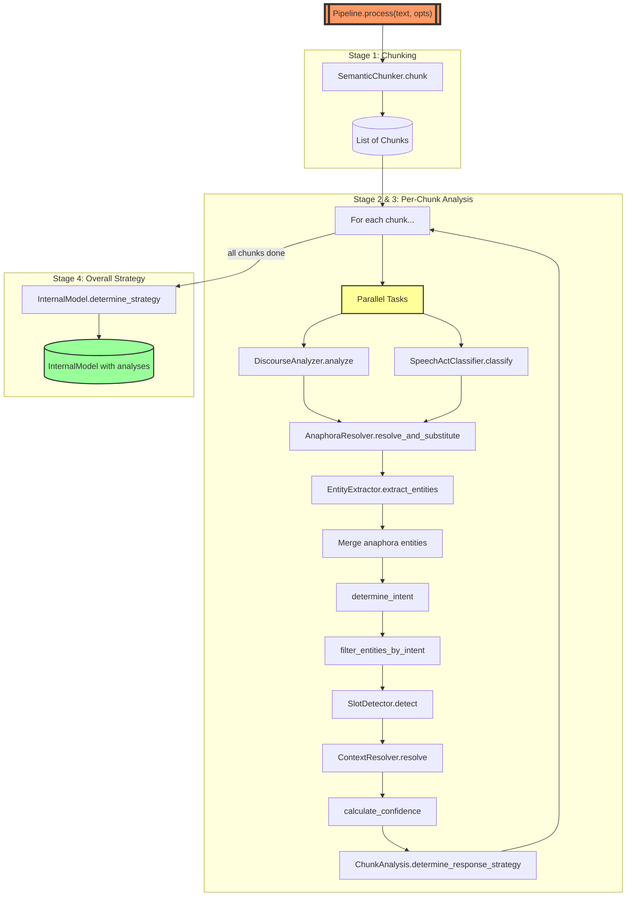

## Per-Chunk Analysis Detail

Each chunk goes through this detailed analysis:

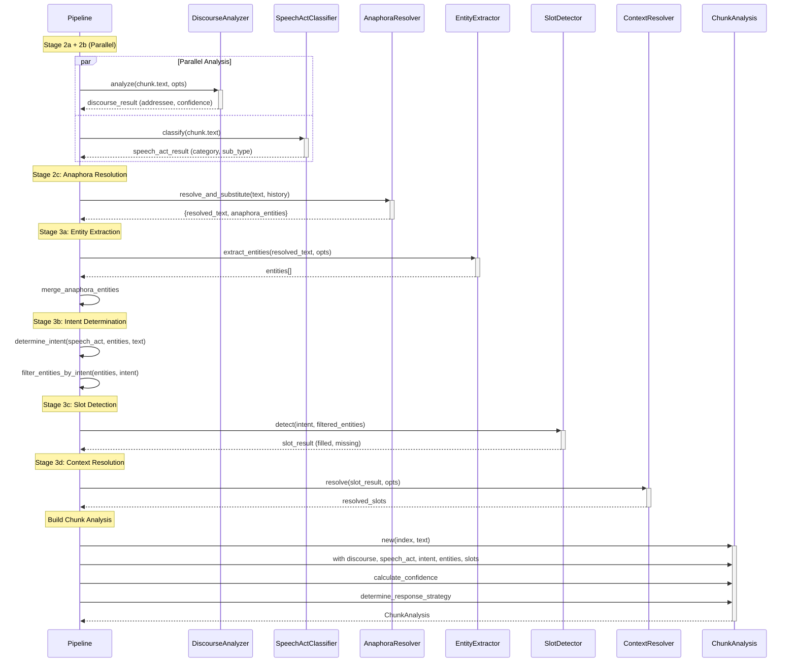

## RacingAnalyzer Fast Path

The racing analyzer provides early-exit optimization:

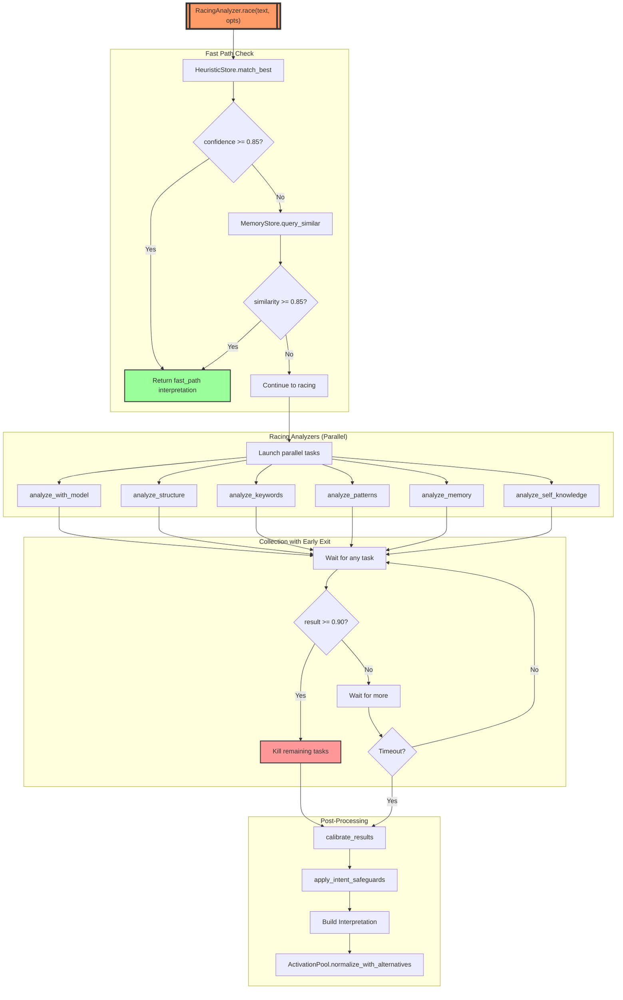

## SpeechActClassifier Multi-Pass Analysis

The speech act classifier uses multiple analysis passes:

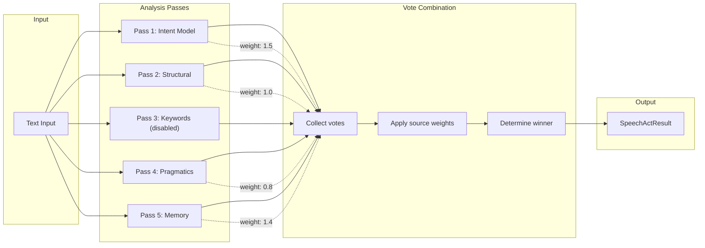

## Response Generation Flow

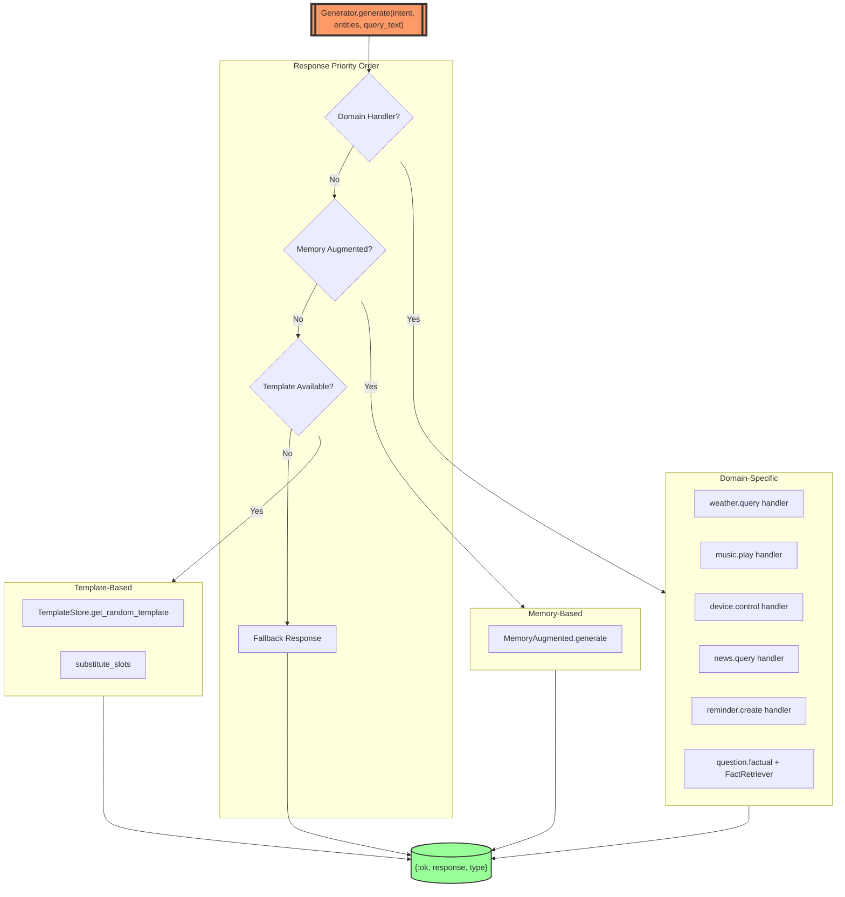

## ResponseGate Decision Tree

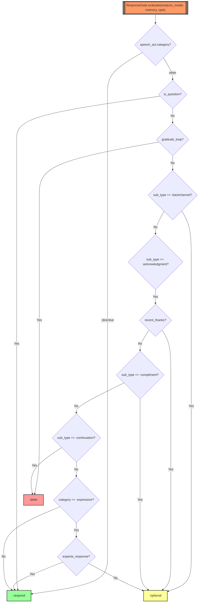

## Data Flow Summary

```
User Input
    │
    ▼
┌─────────────────────────────────────────────────────────────────────────┐
│                            Brain.evaluate                                │
├─────────────────────────────────────────────────────────────────────────┤
│  1. Check if follow-up (FollowupDetector)                               │
│  2. Check for self-knowledge query (SelfKnowledgeAnalyzer)              │
│  3. Check fast-path (RacingAnalyzer → HeuristicStore, MemoryStore)      │
│  4. Run Pipeline.process if no fast-path                                 │
│  5. Check ResponseGate.evaluate for response optionality                │
│  6. Generate response via Generator                                      │
│  7. Store in conversation memory                                         │
│  8. Add to learning queue                                                │
│  9. Extract beliefs (Epistemic system)                                   │
│ 10. Learn from outcome (OutcomeLearner)                                  │
└─────────────────────────────────────────────────────────────────────────┘
    │
    ▼
Response to User
```

## Pipeline Stage Execution Order (Verified)

| Stage | Component | Parallel? | Input | Output |
|-------|-----------|-----------|-------|--------|
| 1 | SemanticChunker.chunk | No | raw text | List<Chunk> |
| 2a | DiscourseAnalyzer.analyze | **Yes** (with 2b) | chunk.text | DiscourseResult |
| 2b | SpeechActClassifier.classify | **Yes** (with 2a) | chunk.text | SpeechActResult |
| 2c | AnaphoraResolver.resolve_and_substitute | No | text, history | resolved_text, entities |
| 3a | EntityExtractor.extract_entities | No | resolved_text | entities |
| 3a' | merge_anaphora_entities | No | entities | merged_entities |
| 3b | determine_intent | No | speech_act, entities | intent |
| 3b' | filter_entities_by_intent | No | entities, intent | filtered_entities |
| 3c | SlotDetector.detect | No | intent, entities | SlotResult |
| 3d | ContextResolver.resolve | No | slot_result, opts | resolved_slots |
| 4 | calculate_confidence | No | analysis | confidence |
| 5 | ChunkAnalysis.determine_response_strategy | No | analysis | strategy |
| 6 | InternalModel.determine_strategy | No | all analyses | overall_strategy |

## Epistemic System

The epistemic system provides truth maintenance and belief management:

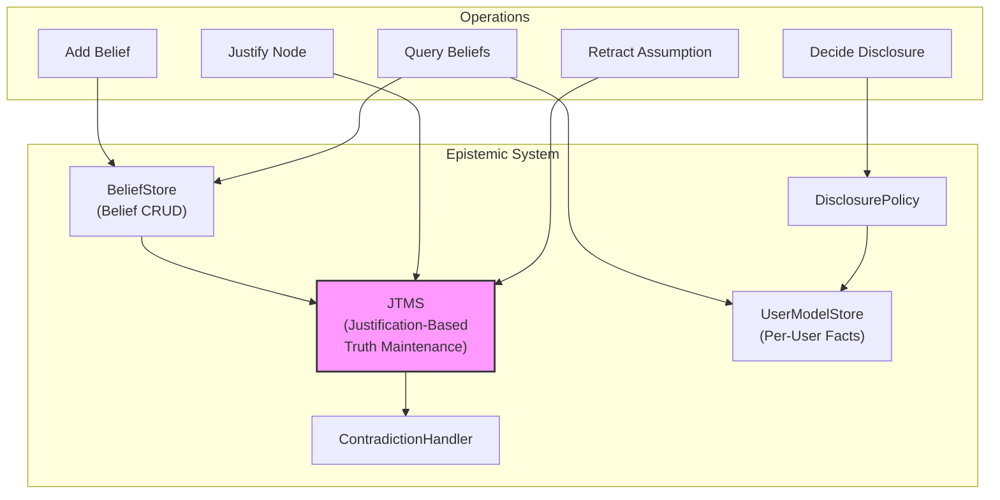

### Key Components:

- **JTMS**: Maintains a dependency network where nodes represent beliefs and justifications link premises to conclusions. Labels (IN/OUT) propagate automatically.
- **BeliefStore**: CRUD operations for beliefs with indexing by subject, predicate, user.
- **UserModelStore**: Per-user knowledge models with confidence tracking and disclosure history.
- **ContradictionHandler**: Triggered when contradiction nodes become IN.

## Memory System (Cognitive Memory)

Ported from a Rust implementation, provides episodic and semantic memory:

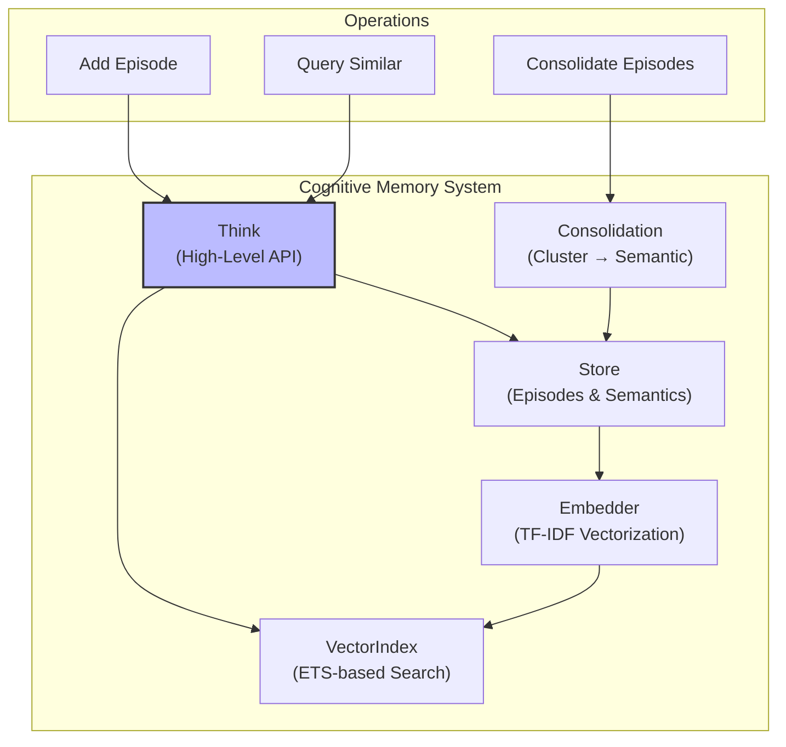

### Memory Types:

| Type | Description |
|------|-------------|
| **Episode** | Individual experience: state, action, outcome, tags, embedding |
| **SemanticFact** | Aggregated knowledge from clustered episodes |
| **Procedure** | Learned action sequences (future) |

### Consolidation:
Episodes with embeddings whose cosine similarity exceeds threshold are clustered. Each cluster becomes a `SemanticFact`.

## Learning System (Training Worlds)

Provides isolated training environments with inheritance:

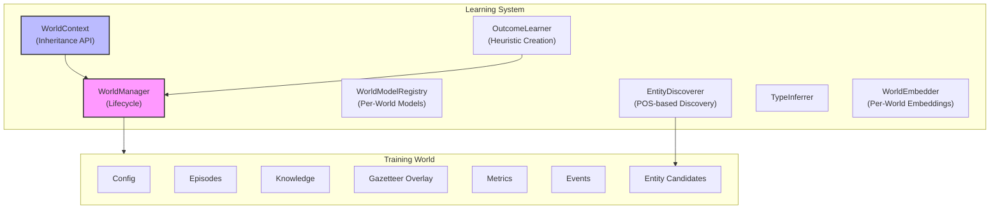

### World Inheritance:
```
Child World → Base World → Default World
```

Data lookups traverse the inheritance chain. Child overrides parent.

### Entity Discovery Flow:
1. `EntityDiscoverer` uses POS tagger to find proper nouns (PROPN)
2. Checks Gazetteer for known types
3. Unknown entities → candidates pool
4. Admin promotes candidates → Gazetteer overlay

### Outcome Learning:
`OutcomeLearner` monitors conversation outcomes:
- Successful patterns → may become heuristics
- Failed heuristics → deprecated
- Calibration data → `AnalyzerCalibration`

## Knowledge Expansion System

Autonomous knowledge gathering with human review:

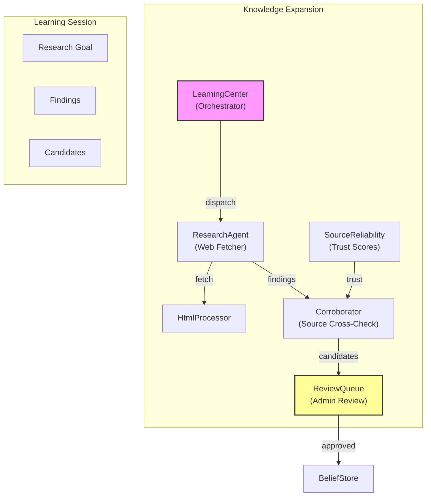

### Flow:
1. `LearningCenter.start_session(topic)` creates goals
2. `ResearchAgent` tasks fetch web content
3. Content cleaned by `HtmlProcessor`
4. Claims extracted via `Pipeline.process`
5. `Corroborator` cross-checks sources
6. Candidates checked for contradictions with `BeliefStore`
7. `ReviewQueue` holds for admin approval
8. Approved facts → `BeliefStore` + `FactDatabase`

## Classical NLP Components

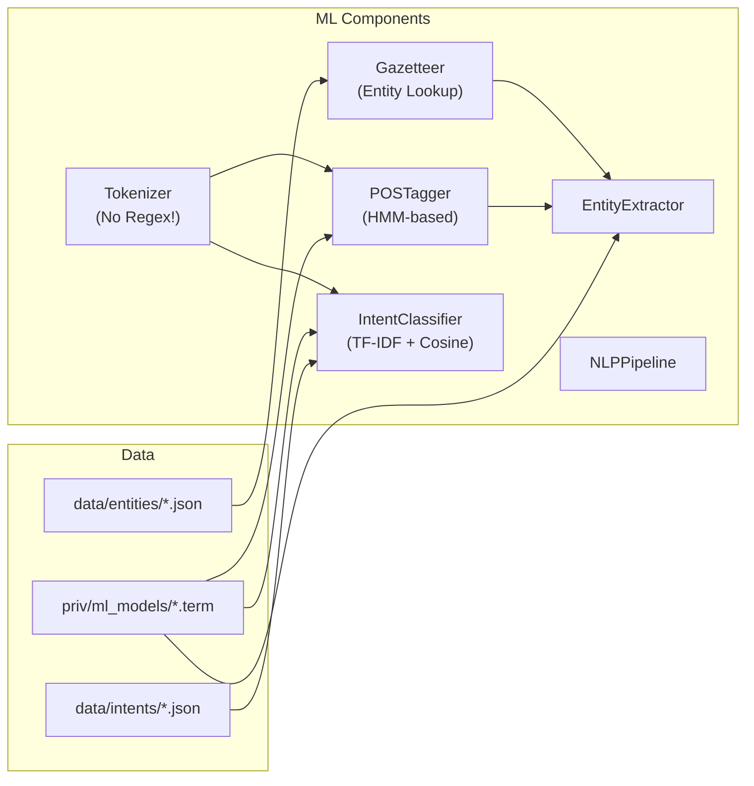

### Key Design Principles:
- **No Regex in NLP**: All text processing via `Tokenizer` functions
- **TF-IDF Vectorization**: Intent classification and memory similarity
- **ETS for Speed**: Gazetteer lookups use ETS tables
- **World-Scoped Models**: Each training world can have its own classifier

## Learner Module

Extracts knowledge from conversations:

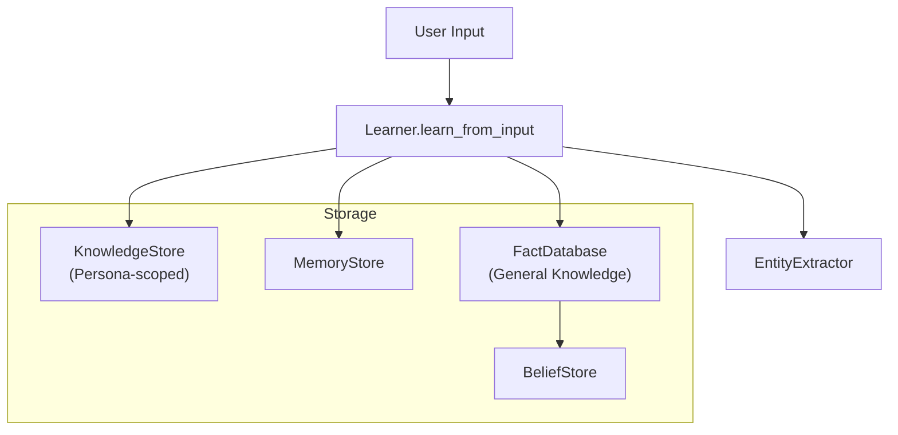

Entity types processed:
- person, pet, room, device, place, task, event, preference

## Key Component Descriptions

### Brain (GenServer)
The central orchestrator that manages conversations, processes input, and coordinates all subsystems. Entry point: `Brain.evaluate/3`.

### Analysis Pipeline
Orchestrates text analysis through multiple stages. Each chunk goes through discourse analysis, speech act classification, entity extraction, slot detection, and context resolution.

### RacingAnalyzer
Runs multiple interpretation paths in parallel with early-exit optimization. Fast paths: heuristics, memory similarity.

### SpeechActClassifier
5 analysis passes (intent model, structural, keywords, pragmatics, memory) with weighted voting to classify pragmatic function (Searle's taxonomy).

### ResponseGate
Determines if a response is appropriate based on speech act sequences. Handles gratitude loops, backchannels, compliments, and continuations.

### Generator
Unified response generation: domain handlers → memory-augmented → templates → fallback.

### JTMS (Justification-Based Truth Maintenance)
Classic JTMS implementation. Nodes = beliefs, Justifications = dependencies. Labels propagate automatically on changes.

### WorldManager
Manages training world lifecycle. ETS-backed for performance. Supports ephemeral and persistent modes.

### LearningCenter
Orchestrates autonomous knowledge gathering. Dispatches ResearchAgents as supervised Tasks.

### OutcomeLearner
Learns from conversation outcomes to create/update heuristics. Scoped by user/cohort/global.

## Confirming Pipeline Order

To verify the actual execution order at runtime, you can:

1. **Enable debug logging**: The Pipeline module logs at each stage with `Progress.report/3`

2. **Check telemetry events**: The system emits telemetry spans for:
   - `:pipeline_process`
   - `:racing_analysis`
   - `:brain_evaluate`
   - `:knowledge_research`
   - `:belief_operation`
   - `:jtms_justify`

3. **Review the code execution**:
   - `Pipeline.process/2` → `do_process/2` runs stages sequentially
   - `analyze_single_chunk/2` runs stages 2a/2b in parallel, then 2c-5 sequentially
   - `InternalModel.determine_strategy/1` runs after all chunks are analyzed
