# ChatBot Architecture

This document provides a comprehensive visual guide to the ChatBot application's architecture, subsystems, and pipeline execution order.

## System Overview

The ChatBot is a **classical NLP chatbot** (no LLMs) built on several interconnected subsystems:

| Subsystem | Purpose |
|-----------|---------|
| **Analysis Pipeline** | Text understanding (chunking, discourse, speech acts, slots) |
| **Epistemic System** | Truth maintenance, beliefs, user models |
| **Memory System** | Episodic/semantic memory with consolidation |
| **Learning System** | Training worlds, entity discovery, heuristic learning |
| **Knowledge Expansion** | Scientific method research, hypothesis testing, admin review |
| **Response Generation** | Template-based, semantic fact retrieval, memory-augmented responses |
| **Task Training** | Domain-specific task training via LearningCenter |

## High-Level Overview

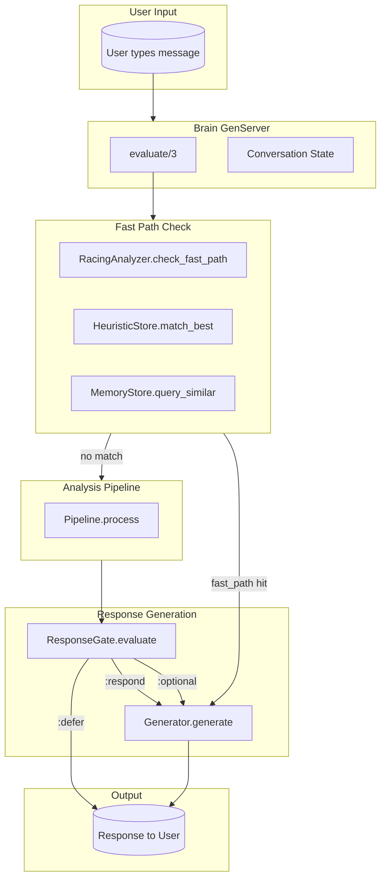

## Comprehensive End-to-End Flow

This diagram shows the actual code path from `Brain.evaluate/3` through all systems:

```mermaid
flowchart TD
    %% =========================================================================
    %% USER INPUT
    %% =========================================================================
    USER((("User"))) --> INPUT["Brain.evaluate(conv_id, input, opts)"]

    %% =========================================================================
    %% BRAIN: try_classical_nlp_first
    %% =========================================================================
    INPUT --> FOLLOWUP{"FollowupDetector<br/>is_followup?"}
    
    FOLLOWUP -->|Yes| FOLLOWUP_HANDLER["handle_followup_message"]
    FOLLOWUP_HANDLER --> RUN_PIPE_FU["run_analysis_pipeline"]
    RUN_PIPE_FU --> MERGE_PREV["Merge with previous context"]
    MERGE_PREV --> GEN_RESP
    
    FOLLOWUP -->|No| NEW_MSG["process_new_message"]

    %% =========================================================================
    %% BRAIN: process_new_message
    %% =========================================================================
    NEW_MSG --> META{"SelfKnowledgeAnalyzer<br/>is_self_knowledge_query?"}
    
    META -->|Yes| META_HANDLER["handle_meta_cognitive_query"]
    META_HANDLER --> BUILD_SELF["Build self-knowledge assessment"]
    BUILD_SELF --> SYNTH["Synthesizer.generate_epistemic_response"]
    SYNTH --> OUTPUT
    
    META -->|No| FAST_CHECK["RacingAnalyzer.check_fast_path"]

    %% =========================================================================
    %% FAST PATH CHECK
    %% =========================================================================
    subgraph FastPath["Fast Path Check"]
        FAST_CHECK --> HEUR_MATCH["HeuristicStore.match_best"]
        FAST_CHECK --> MEM_SIM["Memory.Store.query_similar"]
        HEUR_MATCH --> FAST_RESULT
        MEM_SIM --> FAST_RESULT{"fast_path<br/>or :no_match?"}
    end
    
    FAST_RESULT -->|":fast_path"| FAST_HANDLER["handle_fast_path_response"]
    FAST_HANDLER --> GEN_FAST["Generator.generate(intent, entities)"]
    GEN_FAST --> OUTPUT
    
    FAST_RESULT -->|":no_match"| STANDARD["process_standard_message"]

    %% =========================================================================
    %% STANDARD MESSAGE PROCESSING
    %% =========================================================================
    STANDARD --> RUN_PIPE["run_analysis_pipeline(input, memory, opts)"]
    
    %% =========================================================================
    %% ANALYSIS PIPELINE (Pipeline.process)
    %% =========================================================================
    subgraph Pipeline["Pipeline.process"]
        RUN_PIPE --> CHUNK["1. SemanticChunker.chunk"]
        CHUNK --> ANALYZE["2. analyze_chunks (per chunk)"]
        
        subgraph PerChunk["Per-Chunk Analysis"]
            ANALYZE --> DISC["DiscourseAnalyzer.analyze"]
            ANALYZE --> SPEECH["SpeechActClassifier.classify"]
            ANALYZE --> ANAPH["AnaphoraResolver.resolve"]
            DISC --> ENTITY["EntityExtractor.extract_entities"]
            SPEECH --> ENTITY
            ANAPH --> ENTITY
            ENTITY --> INTENT["IntentClassifierSimple.classify"]
            INTENT --> SLOTS["SlotDetector.detect"]
            SLOTS --> CTX["ContextResolver.resolve"]
            CTX --> CONF["calculate_confidence"]
        end
        
        CONF --> STRATEGY["3. InternalModel.determine_strategy"]
    end
    
    STRATEGY --> MODEL["analysis_model"]

    %% =========================================================================
    %% RESPONSE GATE
    %% =========================================================================
    MODEL --> GATE["ResponseGate.evaluate(analysis_model, memory)"]
    
    GATE --> GATE_DEC{Response<br/>Decision}
    
    GATE_DEC -->|":defer"| DEFER_OUT["Return nil (no response)"]
    DEFER_OUT --> POST
    
    GATE_DEC -->|":optional >= threshold"| OPT_DEFER["Return nil (optional defer)"]
    OPT_DEFER --> POST
    
    GATE_DEC -->|":respond / :optional < threshold"| PROCEED["proceed_with_standard_response"]

    %% =========================================================================
    %% PROCEED WITH RESPONSE (strategy-based)
    %% =========================================================================
    PROCEED --> STRAT_CHECK{overall_strategy?}
    
    STRAT_CHECK -->|":needs_clarification"| CLARIFY["build_clarification_response"]
    CLARIFY --> OUTPUT
    
    STRAT_CHECK -->|":partial_response_with_clarification"| PARTIAL["try_nlp_with_analysis + clarification"]
    PARTIAL --> OUTPUT
    
    STRAT_CHECK -->|":defer_to_user"| ACK["simple_acknowledgment"]
    ACK --> OUTPUT
    
    STRAT_CHECK -->|":cannot_respond"| FALLBACK["simple_fallback_response"]
    FALLBACK --> OUTPUT
    
    STRAT_CHECK -->|":can_respond"| NLP_ANALYSIS["try_nlp_with_analysis"]

    %% =========================================================================
    %% try_nlp_with_analysis
    %% =========================================================================
    subgraph NLPAnalysis["try_nlp_with_analysis"]
        NLP_ANALYSIS --> COLLECT_INTENTS["Collect intents from all chunks"]
        COLLECT_INTENTS --> PRIORITIZE["Prioritize substantive over expressives"]
        PRIORITIZE --> SELECT_CHUNK["Select best chunk for entities"]
        SELECT_CHUNK --> MULTI_CHECK{num_chunks > 1?}
        
        MULTI_CHECK -->|Yes| USE_ANALYSIS["Use per-chunk analysis only"]
        MULTI_CHECK -->|No| NLP_PIPE["NLPPipeline.process"]
        NLP_PIPE --> MERGE_ENT["merge_entities"]
        USE_ANALYSIS --> FINAL_ENT["Final intent + entities"]
        MERGE_ENT --> FINAL_ENT
    end
    
    FINAL_ENT --> LEARN_CONV["Learner.learn_from_conversation"]
    LEARN_CONV --> GEN_RESP["generate_analysis_response_with_type"]

    %% =========================================================================
    %% RESPONSE GENERATION
    %% =========================================================================
    subgraph ResponseGen["Generator.generate_from_analysis"]
        GEN_RESP --> EXPR_CHECK{"Has expressives?"}
        EXPR_CHECK -->|Yes| GEN_EXPR["generate_expressive"]
        GEN_EXPR --> TPL_EXPR["TemplateStore.get_expressive_response"]
        
        EXPR_CHECK --> SUBST_CHECK{"Has substantive intent?"}
        SUBST_CHECK -->|Yes| GEN_MAIN["Generator.generate(intent, entities, query)"]
        
        subgraph GenPriority["Response Priority"]
            GEN_MAIN --> D1{"Domain handler?"}
            D1 -->|Yes| DOMAIN["Domain-specific response"]
            D1 -->|No| D2{"Memory match?"}
            D2 -->|Yes| MEM_AUG["MemoryAugmented.generate"]
            D2 -->|No| D3{"Template available?"}
            D3 -->|Yes| TPL["TemplateStore.get_random_template"]
            D3 -->|No| FB["Fallback response"]
        end
        
        DOMAIN --> SLOT_SUB["TemplateStore.substitute_slots"]
        MEM_AUG --> SLOT_SUB
        TPL --> SLOT_SUB
        FB --> SLOT_SUB
        TPL_EXPR --> COMPOSE["Composer.compose (if multi-part)"]
        SLOT_SUB --> COMPOSE
    end
    
    COMPOSE --> OUTPUT["Response"]

    %% =========================================================================
    %% POST-RESPONSE PROCESSING
    %% =========================================================================
    OUTPUT --> POST["Post-Response Processing"]
    
    subgraph PostProcess["Storage & Learning"]
        POST --> BUILD_CTX["build_context_snapshot"]
        BUILD_CTX --> ADD_MEM["Update conversation memory"]
        ADD_MEM --> ADD_QUEUE["Add to learning_queue"]
        ADD_QUEUE --> BELIEFS["extract_and_store_beliefs"]
        BELIEFS --> OUTCOME["OutcomeLearner.learn_from_outcome"]
    end
    
    OUTCOME --> USER_OUT((("User")))

    %% =========================================================================
    %% DATA STORE ACCESS (dotted lines)
    %% =========================================================================
    HEUR_MATCH -.->|read| HEUR_STORE[("HeuristicStore")]
    MEM_SIM -.->|query| MEM_STORE[("Memory.Store")]
    ENTITY -.->|lookup| GAZ[("Gazetteer")]
    MEM_AUG -.->|query similar| MEM_STORE
    TPL -.->|get template| TPL_STORE[("TemplateStore")]
    TPL_EXPR -.->|get template| TPL_STORE
    ADD_MEM -.->|store| MEM_STORE
    BELIEFS -.->|store| BELIEF_STORE[("BeliefStore")]
    OUTCOME -.->|update| HEUR_STORE
    LEARN_CONV -.->|store| KNOW_STORE[("KnowledgeStore")]
    
    %% ML Layer access
    SPEECH -.-> IC_MODEL[("IntentClassifierSimple")]
    ENTITY -.-> POS_MODEL[("POSTagger")]
    MEM_SIM -.-> EMBED[("Embedder")]
    MEM_AUG -.-> EMBED

    %% =========================================================================
    %% STYLING
    %% =========================================================================
    style USER fill:#ffd700,stroke:#333,stroke-width:3px
    style USER_OUT fill:#ffd700,stroke:#333,stroke-width:3px
    style INPUT fill:#ff9966,stroke:#333,stroke-width:2px
    style Pipeline fill:#e6f3ff,stroke:#333,stroke-width:2px
    style FastPath fill:#fff3e6,stroke:#333,stroke-width:2px
    style ResponseGen fill:#e6ffe6,stroke:#333,stroke-width:2px
    style PostProcess fill:#ffe6e6,stroke:#333,stroke-width:2px
    style NLPAnalysis fill:#f0e6ff,stroke:#333,stroke-width:2px
    
    style MEM_STORE fill:#e6e6ff,stroke:#333
    style TPL_STORE fill:#e6e6ff,stroke:#333
    style HEUR_STORE fill:#e6e6ff,stroke:#333
    style BELIEF_STORE fill:#e6e6ff,stroke:#333
    style KNOW_STORE fill:#e6e6ff,stroke:#333
    style GAZ fill:#e6e6ff,stroke:#333
    style IC_MODEL fill:#cccccc,stroke:#333
    style POS_MODEL fill:#cccccc,stroke:#333
    style EMBED fill:#cccccc,stroke:#333
```

### Actual Code Path Summary

| Step | Function | Decision Point | Outcomes |
|------|----------|----------------|----------|
| 1 | `Brain.evaluate/3` | Entry point | Calls `try_classical_nlp_first` |
| 2 | `try_classical_nlp_first` | `FollowupDetector.is_followup?` | Yes → `handle_followup_message`, No → `process_new_message` |
| 3 | `process_new_message` | `SelfKnowledgeAnalyzer.is_self_knowledge_query?` | Yes → `handle_meta_cognitive_query`, No → `RacingAnalyzer.check_fast_path` |
| 4 | `check_fast_path` | HeuristicStore + Memory similarity | `:fast_path` → `handle_fast_path_response`, `:no_match` → `process_standard_message` |
| 5 | `process_standard_message` | `run_analysis_pipeline` → `ResponseGate.evaluate` | `:defer` → nil, `:respond` → `proceed_with_standard_response` |
| 6 | `proceed_with_standard_response` | `analysis_model.overall_strategy` | `:needs_clarification`, `:partial_response_with_clarification`, `:defer_to_user`, `:cannot_respond`, `:can_respond` |
| 7 | `try_nlp_with_analysis` | Multi-chunk check | Single chunk → `NLPPipeline.process`, Multi-chunk → use per-chunk analysis only |
| 8 | `generate_analysis_response_with_type` | `Generator.generate_from_analysis` | Expressives + substantive combined via `Composer` |
| 9 | Post-response | Storage + Learning | Memory update, beliefs extraction, outcome learning |

## Complete System Interaction Map

```mermaid
flowchart TB
    subgraph User["User Interface"]
        INPUT[("User Input")]
        OUTPUT[("Response")]
    end

    subgraph Core["Core Processing"]
        BRAIN["Brain<br/>(Orchestrator)"]
        PIPE["Pipeline<br/>(Analysis)"]
        RACE["RacingAnalyzer<br/>(Fast Path)"]
        GEN["Generator<br/>(Response)"]
    end

    subgraph Analysis["Analysis Components"]
        CHUNK["SemanticChunker"]
        DISC["DiscourseAnalyzer"]
        SPEECH["SpeechActClassifier"]
        SLOT["SlotDetector"]
        GATE["ResponseGate"]
        ANAPH["AnaphoraResolver"]
        FOLLOW["FollowupDetector"]
    end

    subgraph ML["ML Layer"]
        TOK["Tokenizer"]
        POS["POSTagger"]
        IC["IntentClassifierSimple"]
        EE["EntityExtractor"]
        GAZ["Gazetteer"]
    end

    subgraph Memory["Memory System"]
        EMBED["Embedder"]
        MSTORE["Memory.Store"]
        CONSOL["Consolidation"]
        THINK["Think API"]
    end

    subgraph Epistemic["Epistemic System"]
        JTMS["JTMS"]
        BELIEF["BeliefStore"]
        UMODEL["UserModelStore"]
        CONTRA["ContradictionHandler"]
    end

    subgraph Learning["Learning System"]
        WORLD["WorldManager"]
        WCTX["WorldContext"]
        ENTDISC["EntityDiscoverer"]
        ENTPROM["EntityPromoter"]
        OUTCOME["OutcomeLearner"]
        HEUR["HeuristicStore"]
        TEB["TrainingExampleBuffer"]
    end

    subgraph Knowledge["Knowledge Expansion"]
        LC["LearningCenter"]
        RA["ResearchAgent"]
        COMPRA["ComprehensionAssessor"]
        RQ["ReviewQueue"]
        SR["SourceReliability"]
        LTRIG["LearningTriggers"]
    end

    subgraph Stores["Data Stores"]
        KS["KnowledgeStore"]
        FD["FactDatabase"]
        MS["MemoryStore"]
        TS["TemplateStore"]
    end

    %% Main flow
    INPUT --> BRAIN
    BRAIN --> RACE
    RACE -->|fast path| GEN
    RACE -->|no match| PIPE
    PIPE --> GATE
    GATE --> GEN
    GEN --> OUTPUT

    %% Analysis dependencies
    PIPE --> CHUNK
    PIPE --> DISC
    PIPE --> SPEECH
    PIPE --> SLOT
    PIPE --> ANAPH
    BRAIN --> FOLLOW
    SPEECH --> IC
    SLOT --> GAZ

    %% ML dependencies
    DISC --> TOK
    SPEECH --> TOK
    SPEECH --> POS
    EE --> TOK
    EE --> GAZ
    EE --> POS

    %% Memory usage
    RACE --> MSTORE
    SPEECH --> MSTORE
    BRAIN --> THINK
    THINK --> MSTORE
    MSTORE --> EMBED
    CONSOL --> MSTORE

    %% Epistemic usage
    BRAIN --> BELIEF
    BRAIN --> UMODEL
    JTMS --> CONTRA
    BELIEF --> JTMS
    SLOT --> UMODEL

    %% Learning usage
    BRAIN --> OUTCOME
    OUTCOME --> HEUR
    RACE --> HEUR
    WCTX --> WORLD
    ENTDISC --> WORLD
    WORLD --> GAZ

    %% Knowledge expansion with comprehension gate
    LC --> RA
    RA --> COMPRA
    COMPRA --> RQ
    RQ --> BELIEF
    SR --> RA
    LTRIG --> LC

    %% Autonomous entity/intent learning
    ENTDISC --> ENTPROM
    ENTPROM --> GAZ
    OUTCOME --> TEB
    TEB --> IC

    %% Response generation
    GEN --> TS
    GEN --> FD
    GEN --> MSTORE

    %% Memory consolidation bridge
    CONSOL --> BELIEF

    %% Learner
    BRAIN --> KS
    BRAIN --> MS

    style BRAIN fill:#f96,stroke:#333,stroke-width:4px
    style PIPE fill:#bbf,stroke:#333,stroke-width:2px
    style JTMS fill:#f9f,stroke:#333,stroke-width:2px
    style WORLD fill:#9f9,stroke:#333,stroke-width:2px
    style LC fill:#ff9,stroke:#333,stroke-width:2px
    style COMPRA fill:#f9f,stroke:#333,stroke-width:2px
    style LTRIG fill:#ff9,stroke:#333,stroke-width:2px
    style TEB fill:#fbb,stroke:#333,stroke-width:2px
```

## Application Startup Order

The application starts processes in this order (defined in `application.ex`):

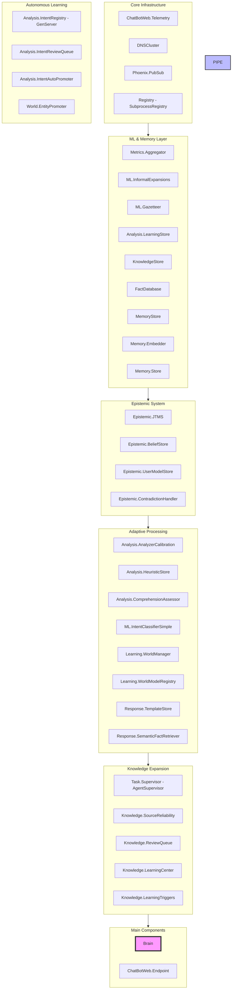

## Brain.evaluate() Flow

This is the main entry point for processing user input:

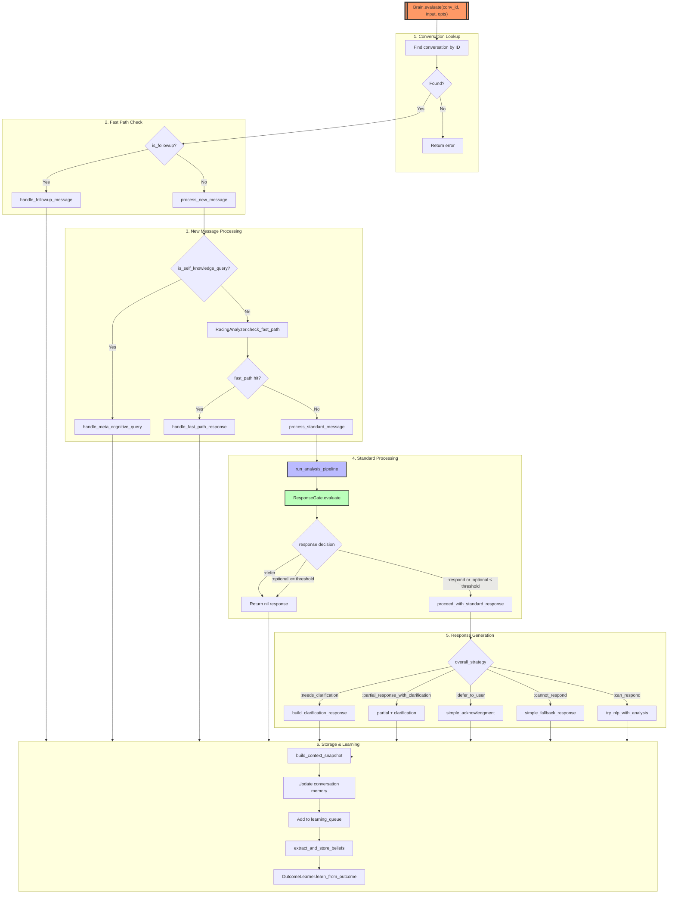

## Analysis Pipeline (Pipeline.process)

This is the core NLP processing pipeline:

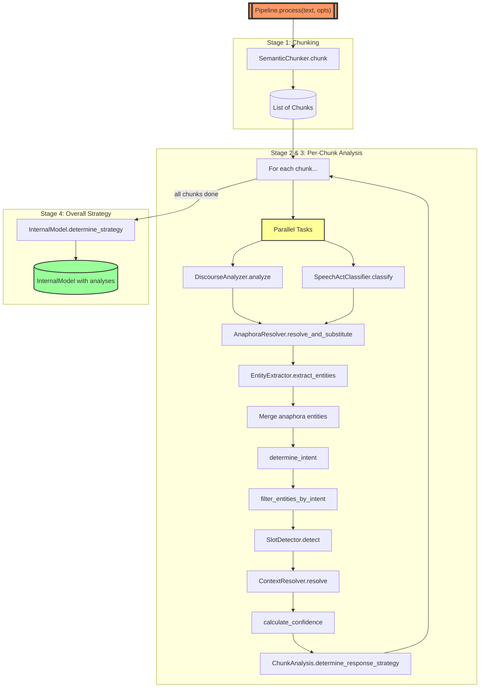

## Per-Chunk Analysis Detail

Each chunk goes through this detailed analysis:

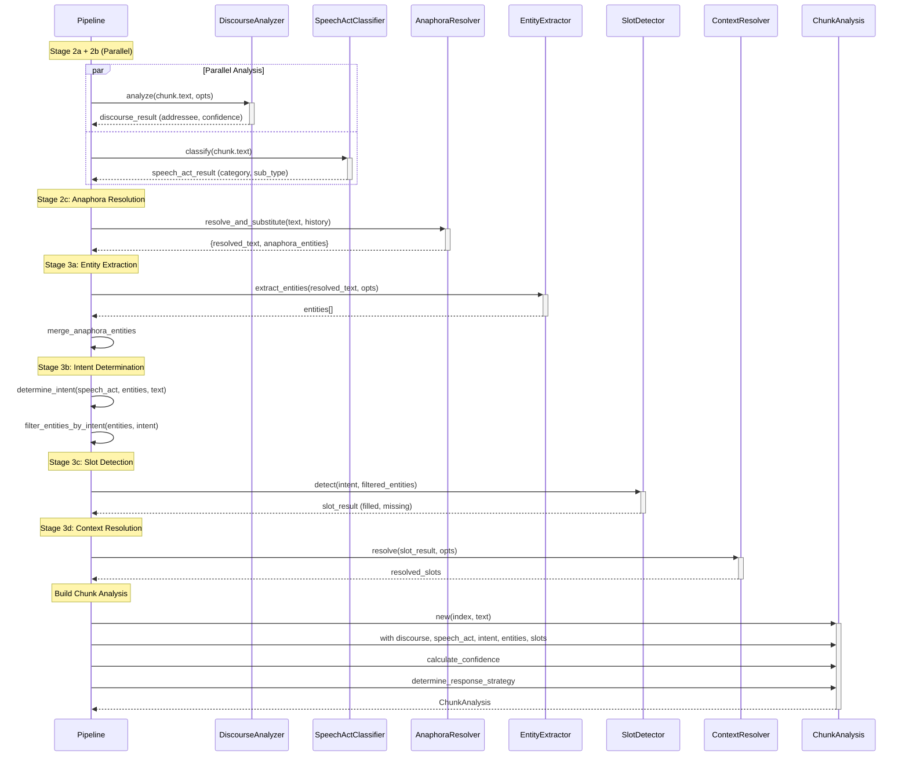

## RacingAnalyzer Fast Path

The racing analyzer provides early-exit optimization:

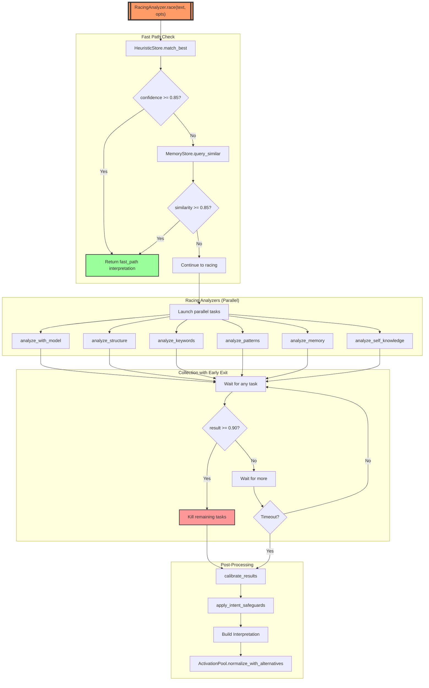

## SpeechActClassifier Multi-Pass Analysis

The speech act classifier uses multiple analysis passes:

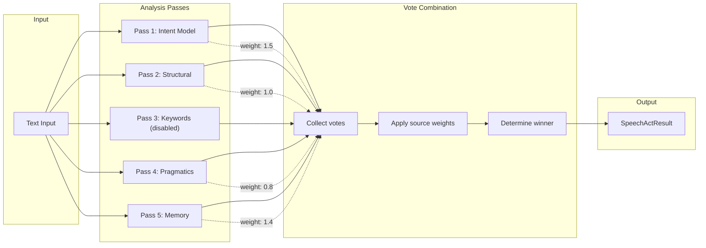

## Response Generation Flow

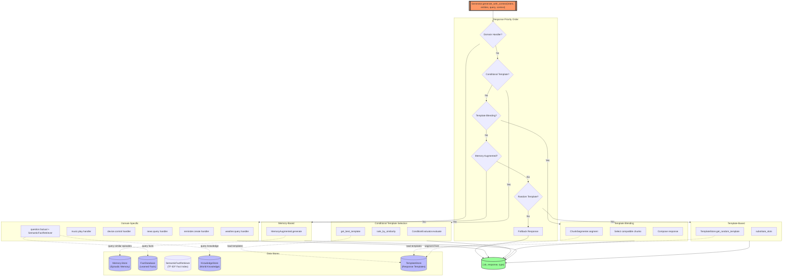

### Data Stores in Response Generation

The response generation system accesses several persistent data stores:

| Store | Purpose | Access Pattern |
|-------|---------|----------------|
| **Memory.Store** | Episodic memory of past interactions | Queried by `MemoryAugmented` for similar past conversations |
| **FactDatabase** | Learned and verified facts | Source of truth for facts (geography, science, history, learned) |
| **SemanticFactRetriever** | TF-IDF indexed fact search | Semantic similarity search over all facts |
| **KnowledgeStore** | World knowledge (entities, relationships) | Queried for entity enrichment and context |
| **TemplateStore** | Response templates with conditions | Queried for template selection and slot substitution |

### Semantic Fact Retrieval

The `SemanticFactRetriever` provides **data-driven fact lookup** using TF-IDF embeddings instead of keyword matching:

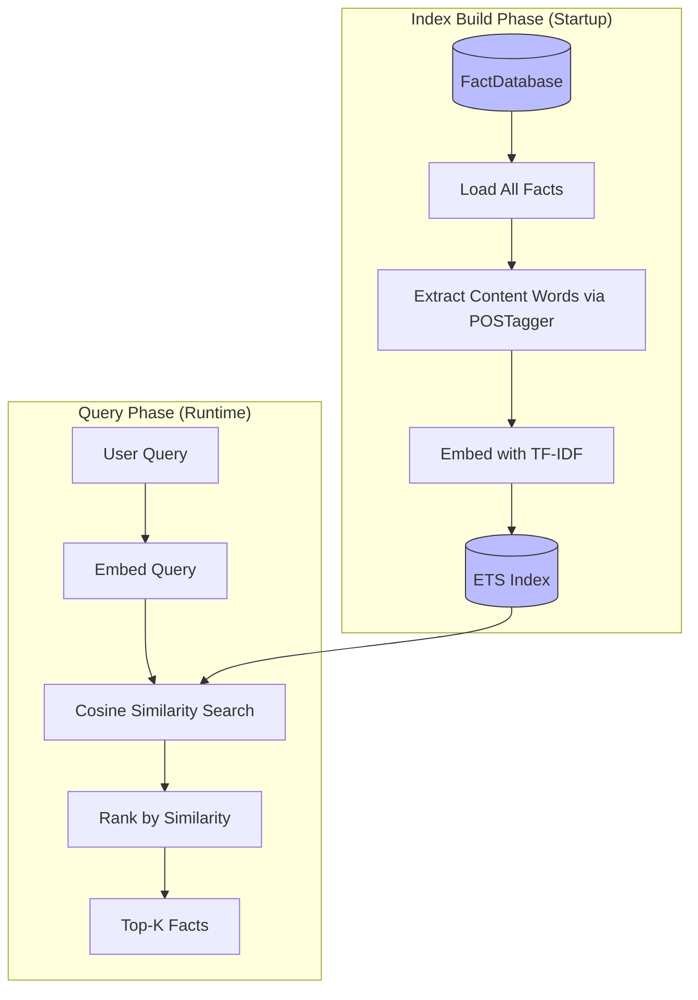

#### Why Semantic Search Instead of Keyword Matching

The project rules prohibit regex and string matching in NLP. Traditional keyword search like:

```elixir
# WRONG - String matching (violates rules)
String.contains?(fact_text, "earthquake")
```

Has fundamental problems:
- Misses synonyms ("quake", "tremor", "seismic event")
- Misses related concepts ("building damage" relates to earthquakes)
- Requires exact phrasing

Semantic search solves this:

```elixir
# CORRECT - Semantic similarity (data-driven)
cosine_similarity(query_embedding, fact_embedding) >= threshold
```

#### How Content Words Are Extracted

Following the no-regex rule, content words are extracted using NLP:

```elixir
# Use Tokenizer and POS tagger (per project rules)
tokens = Tokenizer.tokenize_words(text)
tags = POSTagger.predict_tags(tokens, model)

# Keep content words: NOUN, PROPN, VERB, ADJ, ADV, NUM
content_words = 
  Enum.zip(tokens, tags)
  |> Enum.filter(fn {_, tag} -> tag in content_tags end)
  |> Enum.map(fn {token, _} -> token end)
```

This filters out:
- Metadata prefixes ("Fact:", "Passage:", "Paragraph-")
- Articles ("the", "a", "an")
- Prepositions ("in", "on", "at")
- Other non-content words

#### Example

```
Query: "What is an earthquake?"

POS Analysis: 
  "What" → PRON (filtered)
  "is"   → AUX  (filtered)
  "an"   → DET  (filtered)
  "earthquake" → NOUN (kept)

Query embedding: embed("earthquake")

Fact in database:
  Entity: "Fact: earthquake causes"
  Fact: "The shaking of the ground causes damage to buildings"
  
  Content extraction: "earthquake causes shaking ground causes damage buildings"
  Fact embedding: embed("earthquake causes shaking ground...")

Cosine similarity: 0.72 → MATCH

Response: "The shaking of the ground causes damage to buildings."
```

#### Integration in Response Generation

The `Generator` tries semantic fact retrieval for question intents:

```elixir
def generate_domain_response("question.factual", entities, query_text) do
  # 1. Try semantic search first (data-driven)
  if SemanticFactRetriever.ready?() do
    results = SemanticFactRetriever.search(query_text, limit: 3, threshold: 0.25)
    if results != [] do
      {:ok, format_semantic_results(results)}
    else
      # 2. Fall back to keyword retrieval
      try_keyword_fact_retrieval(entities, query_text)
    end
  else
    try_keyword_fact_retrieval(entities, query_text)
  end
end
```

This ensures:
1. Semantic matches are found even with different phrasing
2. Graceful fallback if semantic index isn't ready
3. All learned facts (from task training) are discoverable

### Memory-First Response Strategy

Before generating a response, the system checks memory for relevant context:

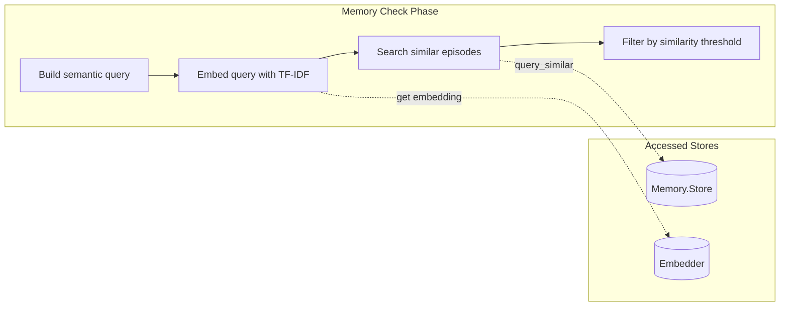

The `MemoryAugmented.generate/3` function:
1. Builds a semantic query from intent + entity values
2. Embeds the query using the TF-IDF `Embedder`
3. Searches `Memory.Store` for similar past episodes (threshold: 0.6)
4. Extracts response patterns from successful past interactions
5. Adapts patterns to current context using slot filling

### Conditional Template Selection with Semantic Ranking

Template selection uses a hybrid approach combining condition-based filtering with semantic ranking:

1. **Condition Filtering**: Templates specify conditions that must match the context
2. **Semantic Ranking**: Among matching templates, the one most similar to the user's query is selected
3. **Cross-Intent Fallback**: If no conditions match, semantic search finds the best template across all intents

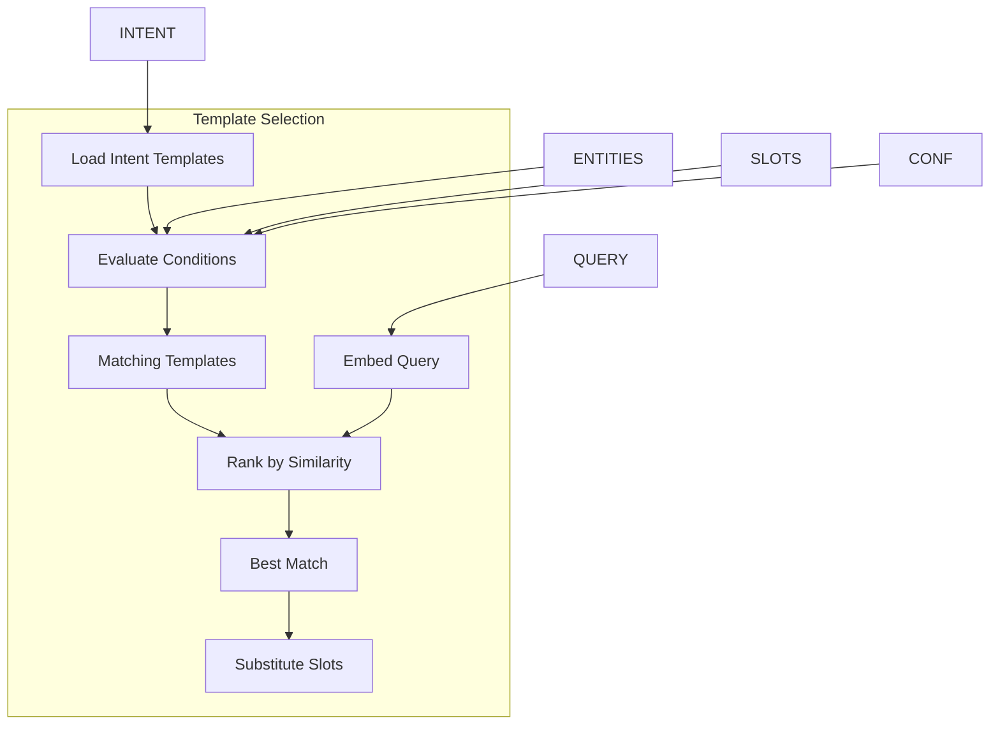

#### Condition Expressions

Templates support condition expressions that reference context signals:

| Condition | Description |
|-----------|-------------|
| `has_entity:type` | Entity of specified type is present |
| `missing_entity:type` | Entity is not present |
| `slot_filled:name` | Slot has a value |
| `slot_missing:name` | Slot is empty |
| `confidence:high/medium/low` | Confidence threshold |
| `speech_act:sub_type` | Speech act matches |

Conditions can be combined with `AND` / `OR`:
- `has_entity:person AND confidence:high`
- `slot_missing:address OR slot_missing:date-time`

#### Example Intent with Conditions

```json
{
  "name": "smalltalk.user.introduction",
  "responses": [{
    "messages": [{
      "speech": ["Nice to meet you, $person!"],
      "condition": "has_entity:person"
    }]
  }],
  "conditionalResponses": [{
    "condition": "missing_entity:person",
    "messages": [{
      "speech": ["Hello! What's your name?"]
    }]
  }]
}
```

#### Semantic Ranking

Each template has a TF-IDF embedding. When multiple templates match conditions, the system:
1. Embeds the user's query
2. Computes cosine similarity against each matching template
3. Selects the template with highest similarity

This ensures responses echo the user's phrasing and tone.

Templates without conditions always match (backward compatible).

### Template Blending for Novel Responses

When no single template is ideal, the system can generate novel responses by blending chunks from multiple templates.

```mermaid
flowchart TD
    subgraph Learning["Learning Phase - Startup"]
        T[All Templates] --> SEG[Segment into Chunks]
        SEG --> CEMB[Embed Each Chunk]
        CEMB --> COMPAT[Learn Chunk Compatibility]
    end

    subgraph Generation["Generation Phase - Runtime"]
        QUERY[Query + Context] --> FILTER[Filter Chunks by Context]
        FILTER --> QEMB[Embed Query]
        QEMB --> SELECT[Select Compatible Chunks]
        SELECT --> BLEND[Blend into Response]
        BLEND --> NOVEL[Novel Response]
    end
```

#### Chunk Types

Templates are segmented into semantic chunks:

| Type | Purpose | Examples |
|------|---------|----------|
| `greeting` | Open conversation | "Hello!", "Nice to meet you!" |
| `acknowledgment` | Confirm understanding | "I understand.", "Got it." |
| `body` | Substantive content | "The weather is...", "Playing..." |
| `offer` | Invite next action | "What else?", "How can I help?" |
| `clarification` | Request missing info | "Which location?", "When?" |
| `closing` | End conversation | "Have a great day!", "Bye!" |

#### Response Flow

The blender determines which chunk types to include based on context:

| Context | Chunk Flow |
|---------|------------|
| Greeting + question | greeting → body → offer |
| Introduction | greeting → acknowledgment |
| Missing slots | acknowledgment → clarification |
| Farewell | body → closing |

#### When Blending Activates

- Query spans multiple intents (greeting + question)
- No single template matches well
- Need to combine acknowledgment with substantive response

#### Example

```
Query: "Hi, I'm Austin and I need help with the weather"

Context:
  - speech_acts: [greeting, request]
  - entities: [person: Austin, topic: weather]
  - missing_slots: [location]

Chunk selection:
  - greeting: "Nice to meet you, $person!" (from intro templates)
  - body: "For weather info..." (from weather templates)
  - clarification: "What location?" (from weather templates)

Blended response:
  "Nice to meet you, Austin! For weather info, what location would you like?"
```

This approach enables emergent response patterns learned from the data rather than hand-coded rules.

## ResponseGate Decision Tree

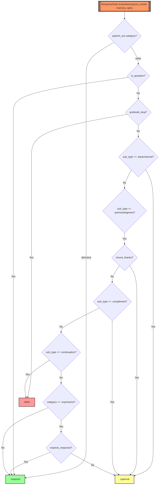

## Data Flow Summary

```
User Input
    │
    ▼
┌─────────────────────────────────────────────────────────────────────────┐
│                            Brain.evaluate                                │
├─────────────────────────────────────────────────────────────────────────┤
│  1. Check if follow-up (FollowupDetector)                               │
│  2. Check for self-knowledge query (SelfKnowledgeAnalyzer)              │
│  3. Check fast-path (RacingAnalyzer → HeuristicStore, MemoryStore)      │
│  4. Run Pipeline.process if no fast-path                                 │
│  5. Check ResponseGate.evaluate for response optionality                │
│  6. Generate response via Generator                                      │
│  7. Store in conversation memory                                         │
│  8. Add to learning queue                                                │
│  9. Extract beliefs (Epistemic system)                                   │
│ 10. Learn from outcome (OutcomeLearner)                                  │
└─────────────────────────────────────────────────────────────────────────┘
    │
    ▼
Response to User
```

## Data Stores Architecture

The system uses several persistent data stores for different purposes:

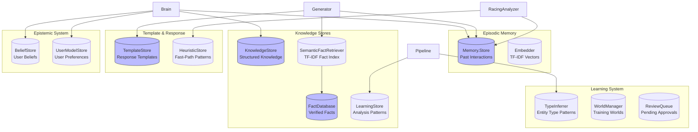

### Store Descriptions

| Store | Module | Persistence | Purpose |
|-------|--------|-------------|---------|
| **Memory.Store** | `Brain.Memory.Store` | GenServer + File | Episodic memory of user interactions |
| **FactDatabase** | `Brain.FactDatabase` | GenServer + File | Verified facts (geography, science, history, learned) |
| **SemanticFactRetriever** | `Brain.Response.SemanticFactRetriever` | GenServer + ETS | TF-IDF indexed semantic search over facts |
| **KnowledgeStore** | `Brain.KnowledgeStore` | GenServer + File | Structured world knowledge (entities, relationships) |
| **TemplateStore** | `Brain.Response.TemplateStore` | GenServer (in-memory) | Response templates loaded from JSON files |
| **LearningStore** | `Brain.Analysis.LearningStore` | GenServer + File | Analysis patterns learned from conversations |
| **HeuristicStore** | `Brain.Analysis.HeuristicStore` | GenServer + JSON | Fast-path patterns for common queries |
| **BeliefStore** | `Brain.Epistemic.BeliefStore` | GenServer | User beliefs maintained by JTMS |
| **UserModelStore** | `Brain.Epistemic.UserModelStore` | GenServer | Per-user preferences and context |
| **TypeInferrer** | `World.TypeInferrer` | ETS | Entity type patterns (world-scoped) |
| **WorldManager** | `World.Manager` | GenServer + Files | Training world configurations and data |
| **ReviewQueue** | `Brain.Knowledge.ReviewQueue` | GenServer + File | Facts pending admin approval |
| **TaskSource** | `Tasks.Source` | Stateless | NLP benchmark task data for training |

### Store Access During Response Generation

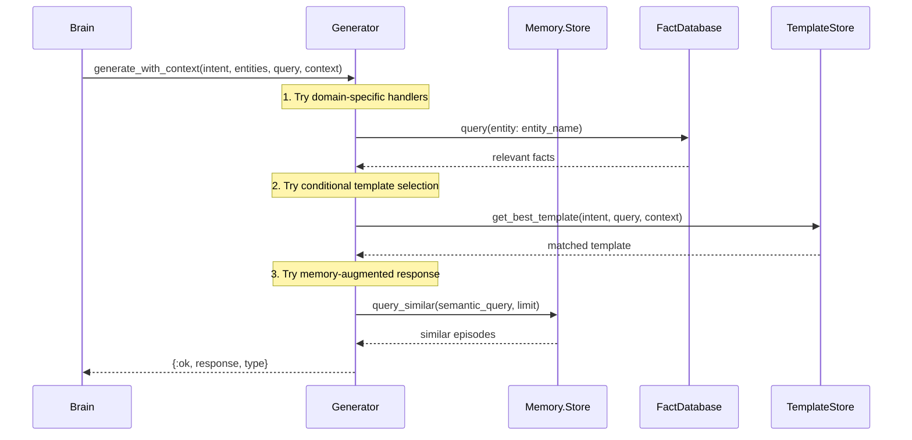

## Pipeline Stage Execution Order (Verified)

| Stage | Component | Parallel? | Input | Output |
|-------|-----------|-----------|-------|--------|
| 1 | SemanticChunker.chunk | No | raw text | List<Chunk> |
| 2a | DiscourseAnalyzer.analyze | **Yes** (with 2b) | chunk.text | DiscourseResult |
| 2b | SpeechActClassifier.classify | **Yes** (with 2a) | chunk.text | SpeechActResult |
| 2c | AnaphoraResolver.resolve_and_substitute | No | text, history | resolved_text, entities |
| 3a | EntityExtractor.extract_entities | No | resolved_text | entities |
| 3a' | merge_anaphora_entities | No | entities | merged_entities |
| 3b | determine_intent | No | speech_act, entities | intent |
| 3b' | filter_entities_by_intent | No | entities, intent | filtered_entities |
| 3c | SlotDetector.detect | No | intent, entities | SlotResult |
| 3d | ContextResolver.resolve | No | slot_result, opts | resolved_slots |
| 4 | calculate_confidence | No | analysis | confidence |
| 5 | ChunkAnalysis.determine_response_strategy | No | analysis | strategy |
| 6 | InternalModel.determine_strategy | No | all analyses | overall_strategy |

## Epistemic System

The epistemic system provides truth maintenance and belief management:

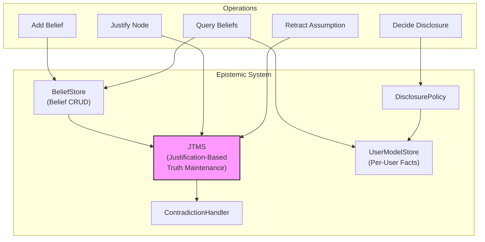

### Key Components:

- **JTMS**: Maintains a dependency network where nodes represent beliefs and justifications link premises to conclusions. Labels (IN/OUT) propagate automatically.
- **BeliefStore**: CRUD operations for beliefs with indexing by subject, predicate, user.
- **UserModelStore**: Per-user knowledge models with confidence tracking and disclosure history.
- **ContradictionHandler**: Triggered when contradiction nodes become IN.

## Memory System (Cognitive Memory)

Ported from a Rust implementation, provides episodic and semantic memory:

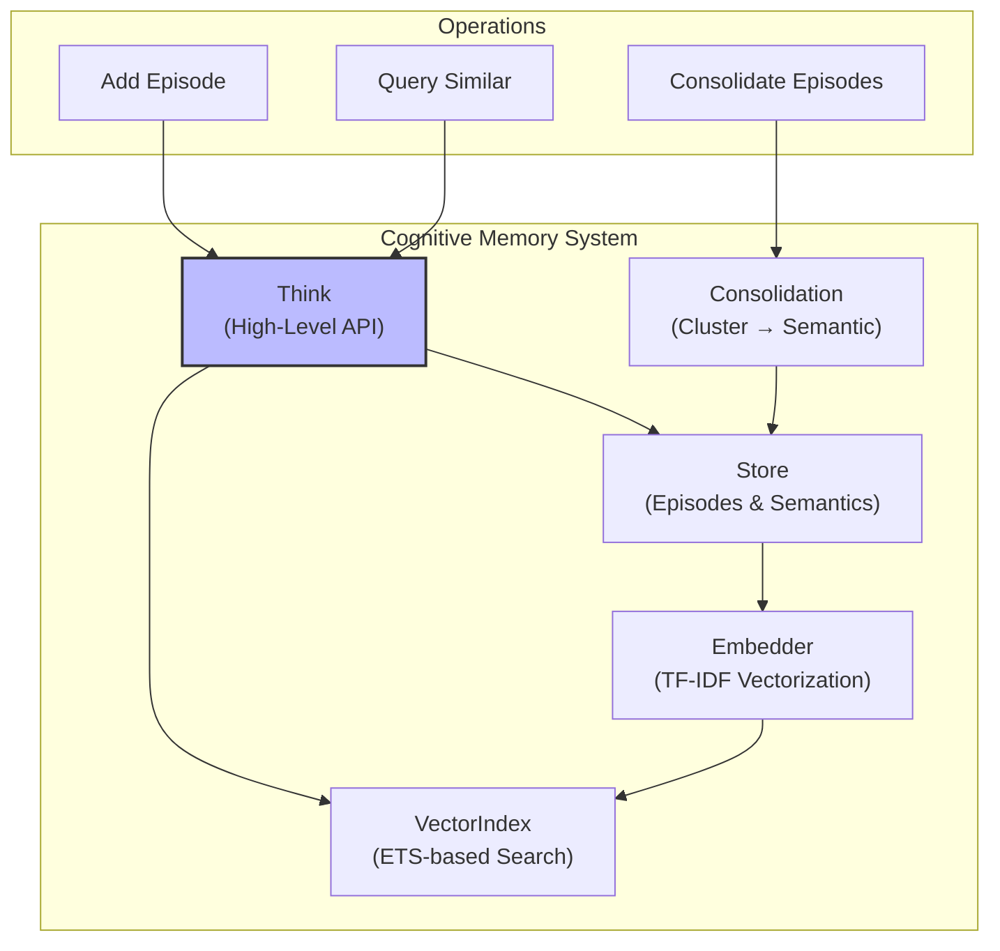

### Memory Types:

| Type | Description |
|------|-------------|
| **Episode** | Individual experience: state, action, outcome, tags, embedding |
| **SemanticFact** | Aggregated knowledge from clustered episodes |
| **Procedure** | Learned action sequences (future) |

### Consolidation:
Episodes with embeddings whose cosine similarity exceeds threshold are clustered. Each cluster becomes a `SemanticFact`.

## Learning System (Training Worlds)

Provides isolated training environments with inheritance:

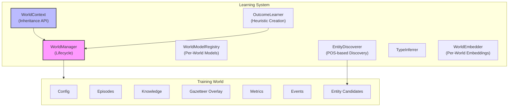

### World Inheritance:
```
Child World → Base World → Default World
```

Data lookups traverse the inheritance chain. Child overrides parent.

### Entity Discovery Flow:
1. `EntityDiscoverer` uses POS tagger to find proper nouns (PROPN)
2. Checks Gazetteer for known types
3. Unknown entities → candidates pool
4. Admin promotes candidates → Gazetteer overlay

### Outcome Learning:
`OutcomeLearner` monitors conversation outcomes:
- Successful patterns → may become heuristics
- Failed heuristics → deprecated
- Calibration data → `AnalyzerCalibration`

## Knowledge Expansion System

Autonomous knowledge gathering following the **scientific method** with human review.

### Scientific Method Integration

The Knowledge Expansion System implements the scientific method for knowledge acquisition:

```mermaid
flowchart TB
    subgraph Scientific["Scientific Method"]
        OBS[("1. Observation<br/>(Topic/Question)")]
        HYP["2. Hypothesis<br/>(Testable Claim)"]
        EXP["3. Investigation<br/>(Gather Evidence)"]
        EVAL["4. Evaluation<br/>(Test Hypothesis)"]
        CONC["5. Conclusion<br/>(Support/Falsify)"]
    end

    subgraph Knowledge["Knowledge Expansion System"]
        LC["LearningCenter<br/>(Orchestrator)"]
        RA["ResearchAgent<br/>(Evidence Gatherer)"]
        TS["TaskSource<br/>(NLP Benchmarks)"]
        COR["Corroborator<br/>(Hypothesis Testing)"]
        SR["SourceReliability<br/>(Trust Scores)"]
        RQ["ReviewQueue<br/>(Admin Review)"]
    end

    subgraph Types["Scientific Types"]
        GOAL[ResearchGoal]
        INV[Investigation]
        HYPS[Hypothesis]
        FIND[Finding]
    end

    OBS --> LC
    LC -->|creates| GOAL
    GOAL -->|generates| HYPS
    HYPS -->|tested in| INV
    LC -->|dispatch| RA
    RA -->|gather| FIND
    FIND -->|evidence for| INV
    INV -->|evaluated by| COR
    COR -->|supported| RQ
    COR -->|falsified| LEARN[("Learning")]
    SR -->|trust| COR

    style LC fill:#f9f,stroke:#333,stroke-width:2px
    style COR fill:#9f9,stroke:#333,stroke-width:2px
    style INV fill:#bbf,stroke:#333,stroke-width:2px
```

### Key Principles

| Principle | Implementation |
|-----------|---------------|
| **Falsifiability** | Hypotheses can be proven false by contradicting evidence |
| **Independent Verification** | Requires 2+ independent sources for support |
| **Evidence Accumulation** | Confidence increases with agreeing evidence |
| **Cannot Prove True** | Hypotheses are "supported", never "proven" |

### Scientific Flow

1. **Observation**: `LearningCenter.start_session(topic)` initiates research
2. **Hypothesis Generation**: `ResearchGoal.generate_hypotheses()` creates testable claims
3. **Evidence Gathering**: `ResearchAgent` fetches from sources (web, tasks)
4. **Hypothesis Testing**: `Corroborator.test_hypotheses()` evaluates evidence
5. **Conclusion**:
   - **Supported**: 2+ agreeing sources, no contradictions → ReviewQueue
   - **Falsified**: Reliable contradicting evidence → Logged for learning
   - **Inconclusive**: Mixed or insufficient evidence

### Hypothesis Lifecycle

```mermaid
stateDiagram-v2
    [*] --> Untested: Created from question
    Untested --> Testing: Evidence gathered
    Testing --> Supported: 2+ sources agree
    Testing --> Falsified: Contradiction found
    Testing --> Inconclusive: Mixed evidence
    Supported --> Promoted: Admin approves
    Promoted --> [*]: Becomes Fact
    Falsified --> [*]: Logged for learning
    Inconclusive --> [*]: More research needed
```

### Example: Scientific Investigation

```elixir
# 1. Start session with questions
{:ok, session} = LearningCenter.start_session("France", 
  questions: ["What is the capital of France?"]
)

# 2. System generates hypothesis:
#    Hypothesis{claim: "capital France", derived_from: "What is the capital?"}

# 3. ResearchAgent gathers evidence:
#    Finding{claim: "Paris is the capital", source: "wikipedia.org"}
#    Finding{claim: "The capital is Paris", source: "britannica.com"}

# 4. Corroborator tests hypothesis:
#    - 2 independent sources agree
#    - No contradictions
#    - Status: :supported, Confidence: 0.85

# 5. Conclusion:
#    - Hypothesis promoted to ReviewCandidate
#    - Admin approves → Becomes fact
```

### Traditional Flow (Legacy)

For backward compatibility, the system falls back to traditional corroboration if:
- Goal not found
- No hypotheses generated

1. `ResearchAgent` tasks fetch from sources
2. `Corroborator.corroborate()` groups by similarity
3. Candidates checked for contradictions
4. `ReviewQueue` holds for admin approval
5. Approved facts → `BeliefStore` + `FactDatabase`

### Task-Based Training

The system can use curated NLP benchmark tasks from `data/domain_specific_tasks/` for training:

```elixir
# Start task-based training
LearningCenter.start_task_training(:question_answering)
LearningCenter.start_task_training(:commonsense)
LearningCenter.start_task_training(:all)
```

Task sources provide:
- **Question Answering**: Factual Q&A pairs
- **Commonsense**: Reasoning with explanations
- **Sentiment Analysis**: Emotion detection
- **Explanation**: Reasoning patterns

Benefits over web sources:
- High-quality, human-verified data
- No network latency or rate limiting
- Reproducible training
- Diverse domains (Wikipedia, Science, News, etc.)

## Autonomous Learning System

The system learns autonomously from conversations, research outcomes, and analysis feedback.
All autonomous features are opt-in, gated by safety mechanisms, and rate-limited.

### Autonomous Learning Overview

```mermaid
flowchart TB
    subgraph Conversation["Conversation Processing"]
        PIPE["Pipeline.process"]
        NOVELTY["NoveltyDetector"]
        OUTCOME["OutcomeLearner"]
        EVENTS["EventExtractor"]
    end

    subgraph Triggers["Learning Triggers"]
        LT["LearningTriggers<br/>(GenServer)"]
        PUBSUB_NOVEL[("PubSub<br/>learning:novel_input")]
    end

    subgraph ComprehensionGate["Comprehension Gate"]
        CA["ComprehensionAssessor<br/>(GenServer + ETS)"]
        DE["DimensionEvaluators<br/>(8 dimensions)"]
        CP["ComprehensionProfile<br/>(verdict + gaps)"]
    end

    subgraph Knowledge["Knowledge Pipeline"]
        LC["LearningCenter"]
        RA["ResearchAgent"]
        COR["Corroborator"]
        RQ["ReviewQueue<br/>(auto-approval)"]
    end

    subgraph BeliefPipeline["Belief Pipeline"]
        BS["BeliefStore<br/>(+ JTMS nodes)"]
        DECAY["Confidence Decay"]
        CB["ConsolidationBridge"]
        CONSOL["Memory.Consolidation"]
    end

    subgraph IntentLearning["Intent Learning"]
        IR["IntentRegistry<br/>(GenServer+ETS)"]
        IAP["IntentAutoPromoter"]
        IRQ["IntentReviewQueue"]
    end

    subgraph ModelUpdates["Incremental Model Updates"]
        TEB["TrainingExampleBuffer<br/>(ETS)"]
        ICS["IntentClassifierSimple<br/>(incremental_update)"]
    end

    subgraph EntityLearning["Entity Learning"]
        EP["EntityPromoter"]
        GAZ["Gazetteer"]
        ED["EntityDiscoverer"]
    end

    %% Conversation → Triggers
    PIPE --> NOVELTY -->|novel input| PUBSUB_NOVEL --> LT
    LT -->|3+ in domain / 24h| LC

    %% Knowledge Pipeline with Comprehension Gate
    LC --> RA
    RA --> CA
    CA --> DE --> CP
    CP -->|learnable| COR
    CP -->|not learnable| BLOCK["Blocked (logged)"]
    COR --> RQ
    RQ -->|auto-approve| BS
    RQ -->|manual review| ADMIN["Admin"]

    %% Belief Pipeline
    EVENTS --> BS
    BS -->|JTMS| JTMS_NODE["JTMS Node"]
    CONSOL --> CB --> BS
    DECAY -.->|periodic| BS

    %% Intent Learning
    NOVELTY --> IRQ
    IAP -->|variations only| IRQ
    IRQ -->|approved| IR

    %% Model Updates
    OUTCOME -->|activation >= 0.8| TEB
    TEB -->|50+ examples| ICS

    %% Entity Promotion
    ED --> EP
    EP -->|>= 3 occurrences| GAZ

    %% Weight Evolution
    RQ -->|approval/rejection| CA_WEIGHTS["Weight Evolution<br/>(EMA)"]
    CA_WEIGHTS --> CA

    %% Styling
    style CA fill:#f9f,stroke:#333,stroke-width:2px
    style LT fill:#ff9,stroke:#333,stroke-width:2px
    style RQ fill:#9f9,stroke:#333,stroke-width:2px
    style BS fill:#bbf,stroke:#333,stroke-width:2px
    style TEB fill:#fbb,stroke:#333,stroke-width:2px
    style BLOCK fill:#f99,stroke:#333,stroke-width:2px
```

### Comprehension Assessment Flow

The ComprehensionAssessor gates knowledge acquisition by scoring text understanding across 8 dimensions:

```mermaid
flowchart LR
    subgraph Input["Pipeline Output"]
        CA_LIST["List<ChunkAnalysis>"]
    end

    subgraph Dimensions["8 Dimension Evaluators"]
        D1["Referential Clarity<br/>WHAT is this about?"]
        D2["Actor Identification<br/>WHO is involved?"]
        D3["Propositional Content<br/>WHAT is claimed?"]
        D4["Temporal Grounding<br/>WHEN does it apply?"]
        D5["Contextual Sufficiency<br/>Enough CONTEXT?"]
        D6["Epistemic Grounding<br/>Relates to known FACTS?"]
        D7["Structural Coherence<br/>Makes SENSE? (hard gate)"]
        D8["Illocutionary Clarity<br/>WHAT KIND of speech?"]
    end

    subgraph Scoring["Profile Building"]
        WEIGHTS["Evolved Weights<br/>(EMA from outcomes)"]
        COMPOSITE["Weighted Composite Score"]
        VERDICT{"Verdict"}
    end

    subgraph Outcomes[""]
        COMP[":comprehended (>= 0.7)<br/>learnable ✓"]
        PART[":partial (>= 0.4)<br/>learnable ✓ (penalty)"]
        OPAQ[":opaque (>= 0.2)<br/>blocked ✗"]
        GARB[":garbled (< 0.2)<br/>blocked ✗"]
    end

    CA_LIST --> D1 & D2 & D3 & D4 & D5 & D6 & D7 & D8
    D1 & D2 & D3 & D4 & D5 & D6 & D7 & D8 --> COMPOSITE
    WEIGHTS --> COMPOSITE
    COMPOSITE --> VERDICT
    VERDICT --> COMP & PART & OPAQ & GARB
    D7 -->|"score < 0.2"| GARB

    style D7 fill:#f99,stroke:#333,stroke-width:2px
    style COMP fill:#9f9
    style PART fill:#ff9
    style OPAQ fill:#fbb
    style GARB fill:#f66
```

### Safety Mechanisms

| Mechanism | Details |
|-----------|---------|
| Comprehension gate | Composite < 0.4 blocks text from learning pipeline |
| Structural coherence hard gate | Score < 0.2 = `:garbled` regardless of other dimensions |
| Partial verdict penalty | Findings from `:partial` comprehension get `confidence * composite_score` |
| Cold-start protection | Dimension weights don't evolve until 10+ outcomes |
| Weight rollback | Last 5 weight snapshots persisted; `reset_weights/0` reverts to equal weights |
| Auto-approval cap | 10/day (ReviewQueue), 5/day (IntentAutoPromoter) |
| Auto-trigger cap | 2 LearningCenter sessions per day |
| Config kill switches | `auto_extraction_enabled`, `auto_approval_enabled` |
| Confidence decay | Inferred beliefs decay 5%/tick; auto-retracted below 0.1 |
| Incremental drift guard | Full retrain after 200 incremental TF-IDF updates |
| Human-in-the-loop | Genuinely new intents always require human approval |
| World isolation | Entity promotions use world-scoped `Gazetteer.add_to_world/4` |
| Backpressure | Belief extraction via `Task.Supervisor` with max_children limits |
| IntentRegistry fallback | Compile-time `@fallback_registry` prevents breakage if GenServer unavailable |

### Supervision Tree (New Components)

These components are added to the supervision trees:

**Brain.Application** (`apps/brain/lib/brain/application.ex`):
```
... existing children ...
├── ComprehensionAssessor    (after HeuristicStore, before KnowledgeStore)
├── IntentRegistry           (before IntentReviewQueue)
├── IntentAutoPromoter       (after IntentReviewQueue)
└── LearningTriggers         (after LearningCenter)
```

**World.Application** (`apps/world/lib/world/application.ex`):
```
├── World.Manager
├── World.ModelRegistry
└── World.EntityPromoter     (new)
```

## Classical NLP Components

```mermaid
flowchart LR
    subgraph ML["ML Components"]
        TOK["Tokenizer<br/>(No Regex!)"]
        POS["POSTagger<br/>(HMM-based)"]
        GAZ["Gazetteer<br/>(Entity Lookup)"]
        IC["IntentClassifierSimple<br/>(TF-IDF + Cosine, World-Scoped)"]
        EE["EntityExtractor"]
        NLP["NLPPipeline"]
    end

    subgraph Data
        INTENTS[data/intents/*.json]
        ENTITIES[data/entities/*.json]
        MODELS[priv/ml_models/*.term]
    end

    INTENTS --> IC
    ENTITIES --> GAZ
    MODELS --> IC
    MODELS --> POS
    MODELS --> EE

    TOK --> POS --> EE
    TOK --> IC
    GAZ --> EE
```

### Key Design Principles:
- **No Regex in NLP**: All text processing via `Tokenizer` functions
- **TF-IDF Vectorization**: Intent classification and memory similarity
- **ETS for Speed**: Gazetteer lookups use ETS tables
- **World-Scoped Models**: Each training world can have its own classifier

## Learner Module

Extracts knowledge from conversations:

```mermaid
flowchart TD
    INPUT[User Input]
    LEARNER["Learner.learn_from_input"]
    EE["EntityExtractor"]
    
    subgraph Storage
        KS["KnowledgeStore<br/>(Persona-scoped)"]
        MS["MemoryStore"]
        FD["FactDatabase<br/>(General Knowledge)"]
        BS["BeliefStore"]
    end

    INPUT --> LEARNER --> EE
    LEARNER --> KS
    LEARNER --> MS
    LEARNER --> FD
    FD --> BS
```

Entity types processed:
- person, pet, room, device, place, task, event, preference

## Key Component Descriptions

### Brain (GenServer)
The central orchestrator that manages conversations, processes input, and coordinates all subsystems. Entry point: `Brain.evaluate/3`.

### Analysis Pipeline
Orchestrates text analysis through multiple stages. Each chunk goes through discourse analysis, speech act classification, entity extraction, slot detection, and context resolution.

### RacingAnalyzer
Runs multiple interpretation paths in parallel with early-exit optimization. Fast paths: heuristics, memory similarity.

### SpeechActClassifier
5 analysis passes (intent model, structural, keywords, pragmatics, memory) with weighted voting to classify pragmatic function (Searle's taxonomy).

### ResponseGate
Determines if a response is appropriate based on speech act sequences. Handles gratitude loops, backchannels, compliments, and continuations.

### Generator
Unified response generation: domain handlers → memory-augmented → templates → fallback.

### JTMS (Justification-Based Truth Maintenance)
Classic JTMS implementation. Nodes = beliefs, Justifications = dependencies. Labels propagate automatically on changes.

### WorldManager
Manages training world lifecycle. ETS-backed for performance. Supports ephemeral and persistent modes.

### LearningCenter
Orchestrates autonomous knowledge gathering using the scientific method. Creates investigations with hypotheses, tests them against evidence, and promotes supported hypotheses to the review queue.

### OutcomeLearner
Learns from conversation outcomes to create/update heuristics. Scoped by user/cohort/global.

## Task-Based Training

The system can train on domain-specific NLP benchmark tasks via `LearningCenter`:

```mermaid
flowchart TB
    subgraph Training["Task Training"]
        LC["LearningCenter"]
        TS["TaskSource"]
        TA["TaskAnalyzer"]
        TT["TaskTransformer"]
    end

    subgraph Tasks["Benchmark Tasks"]
        TASKS[("Task Files<br/>data/domain_specific_tasks/")]
    end

    subgraph Categories
        QA["Question Answering"]
        SENT["Sentiment Analysis"]
        COMM["Commonsense"]
        EXPL["Explanation"]
    end

    subgraph Pipeline["NLP Pipeline"]
        TOK["Tokenizer"]
        POS["POSTagger"]
        GAZ["Gazetteer"]
        IC["IntentClassifierSimple"]
    end

    LC -->|uses| TS
    TS -->|loads| TASKS
    TA -->|analyzes| TASKS
    TT -->|transforms| TASKS
    TASKS --> QA & SENT & COMM & EXPL
    QA --> Pipeline

    style LC fill:#f9f,stroke:#333,stroke-width:2px
    style TS fill:#bbf,stroke:#333,stroke-width:2px
```

### Starting Task Training

```elixir
# Start task-based training
{:ok, session} = LearningCenter.start_task_training(:question_answering,
  max_tasks: 10,
  max_instances: 20
)

# Available categories
LearningCenter.start_task_training(:commonsense)
LearningCenter.start_task_training(:sentiment)
LearningCenter.start_task_training(:all)
```

### Task Sources

Task sources provide curated NLP benchmark data:

| Category | Description | Usage |
|----------|-------------|-------|
| Question Answering | Factual Q&A pairs | Train fact retrieval |
| Commonsense | Reasoning with explanations | Train inference |
| Sentiment Analysis | Emotion detection | Train classification |
| Explanation | Reasoning patterns | Train response generation |

Benefits over web sources:
- High-quality, human-verified data
- No network latency or rate limiting
- Reproducible training
- Diverse domains (Wikipedia, Science, News)

See [SCIENTIFIC_METHOD.md](SCIENTIFIC_METHOD.md) for the scientific method used in knowledge expansion.

## Confirming Pipeline Order

To verify the actual execution order at runtime, you can:

1. **Enable debug logging**: The Pipeline module logs at each stage with `Progress.report/3`

2. **Check telemetry events**: The system emits telemetry spans for:
   - `:pipeline_process`
   - `:racing_analysis`
   - `:brain_evaluate`
   - `:knowledge_research`
   - `:belief_operation`
   - `:jtms_justify`
   - `:code_pipeline` (code analysis)
   - `:code_parse` (code parsing)
   - `:code_extract` (symbol extraction)
   - `:code_gazetteer_lookup` (code symbol lookups)
   - `:code_gazetteer_add` (code symbol additions)

3. **Review the code execution**:
   - `Pipeline.process/2` → `do_process/2` runs stages sequentially
   - `analyze_single_chunk/2` runs stages 2a/2b in parallel, then 2c-5 sequentially
   - `InternalModel.determine_strategy/1` runs after all chunks are analyzed

---

## See Also

- [CONTRIBUTING.md](CONTRIBUTING.md) - Main contributor guide with module API reference
- [PIPELINE_ORDER.md](PIPELINE_ORDER.md) - Detailed pipeline execution order
- [SUBSYSTEM_INTEGRATION_REVIEW.md](SUBSYSTEM_INTEGRATION_REVIEW.md) - Disconnected subsystems and scoping evolution
- [WRITING_TESTS.md](WRITING_TESTS.md) - Testing guide
- [SCIENTIFIC_METHOD.md](SCIENTIFIC_METHOD.md) - Scientific method in knowledge expansion
