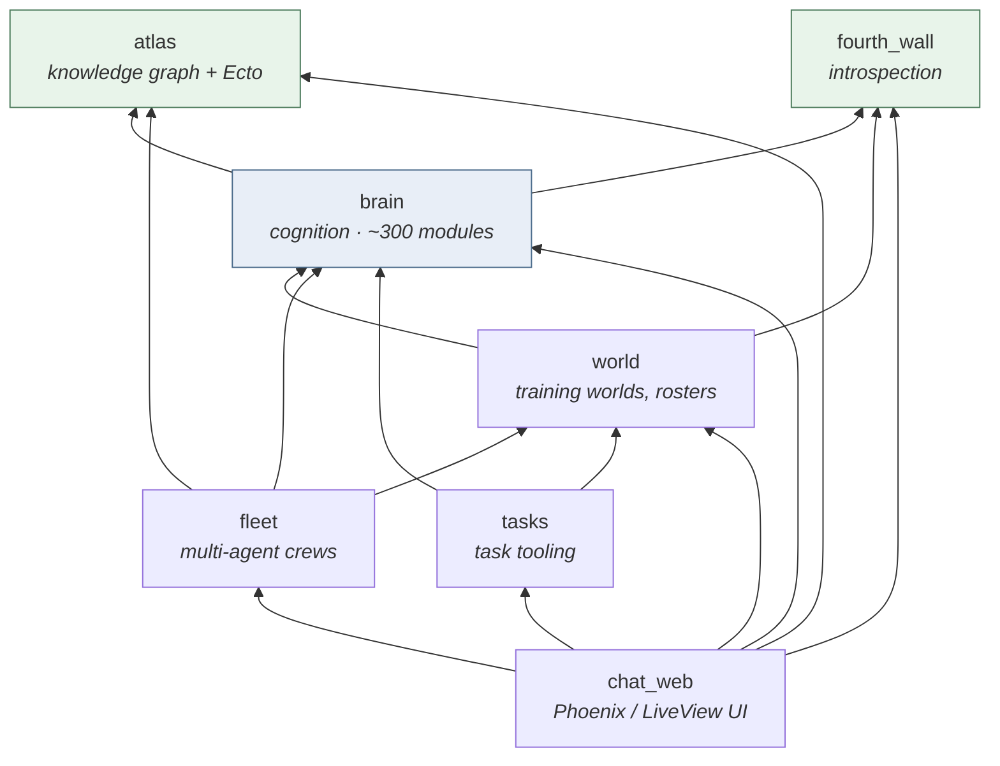
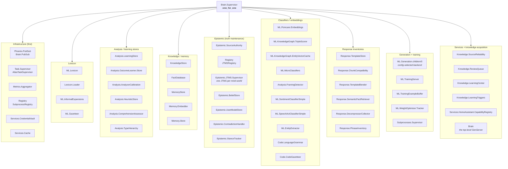
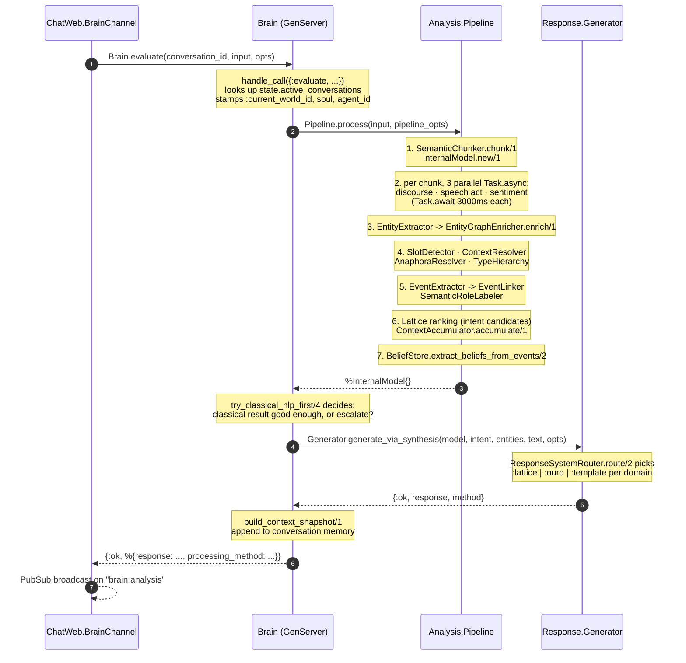

# Architecture

Visual orientation for the umbrella. Every diagram here is derived from code
(`Brain.Application.start/2`, `Brain.Analysis.Pipeline`, the `in_umbrella` deps
in each `mix.exs`) rather than hand-maintained intent, so when they drift the
code is the tiebreaker.

Diagrams are mermaid, which renders on GitHub and in `mix docs` output.

---

## Read this first: 437 modules, 64 of them are "objects"

The single most useful fact for anyone arriving from an OOP language:

| | count | what it is |
|---|---|---|
| Total modules | 437 | namespaces |
| `use GenServer` / `use Agent` | 64 | stateful processes — the closest thing to objects |
| `use Supervisor` / `DynamicSupervisor` | 4 | process lifecycle owners |
| Everything else | ~370 | **pure functions in a namespace** |

Those ~370 have no lifecycle, no instances, and no `new`. `Brain.Analysis.TypeHierarchy`
does not exist at runtime; it is a place where functions live. You do not
instantiate it, wire it, or register it — you call it. Reaching for a class
diagram to understand them is the wrong tool, because there are no
relationships to draw beyond "A calls B".

The 64 GenServers are where the real architecture is, and they are all visible
in one place: the supervision tree below. See
[Implementing a module](IMPLEMENTING_A_MODULE.md) for how to decide which kind
you are writing.

---

## App dependency graph

Seven apps. Arrows point from dependent to dependency (`A --> B` means "A
depends on B").



`atlas` and `fourth_wall` are leaves — they depend on nothing else in the
umbrella, so they compile first and are safe to depend on from anywhere.

### The one inverted edge worth knowing about

`world` depends on `brain`, and `brain` has **no** compile-time dependency on
`world` — but `Brain.Application` calls `World.Embedder` and
`World.ModelRegistry` at runtime anyway, guarded by:

```elixir
@compile {:no_warn_undefined, [World.Embedder, World.ModelRegistry]}
```

and a `Code.ensure_loaded?/1` check at the call site. This is deliberate: those
modules are available at runtime because `world` boots on top of `brain`, but
depending on them at compile time would create a cycle between the two apps.
If you add a similar cross-app runtime call, follow the same pattern — declare
the `no_warn_undefined` and check `ensure_loaded?` before calling.

---

## Brain supervision tree

This is the runtime architecture. ~60 children under one `:one_for_one`
supervisor, started in dependency order — everything below a given entry may
assume everything above it is already alive.

Grouped by role for legibility; the flat list and true order is in
[`apps/brain/lib/brain/application.ex`](../apps/brain/lib/brain/application.ex).



Two things in that tree are worth calling out because they are not obvious
from the module list:

- **`Brain` itself is the last child.** The module `Brain` (in
  [`apps/brain/lib/brain.ex`](../apps/brain/lib/brain.ex)) is a GenServer, not
  a facade of pure functions. It owns conversation state and is the front door
  for `evaluate/3`. It starts last because it depends on everything above it.
- **`ML.Generation.children/0` returns a list that gets spliced in.** The
  default OpenAI-compatible/Ollama backend contributes *zero* children (it is
  just an HTTP endpoint); only the `:ouro_sidecar` backend adds the heavy model
  processes. `Supervisor.start_link` receives `List.flatten(children)` for
  exactly this reason.

### Seeing it live instead

`phoenix_live_dashboard` is already a dependency and already routed. Boot the
app and open `/dashboard`, then the **Applications** tab — it renders the real
supervision tree, with live process state, for every app in the umbrella. That
is the authoritative version of the diagram above.

---

## Request flow: message in, response out

What actually happens on `handle_in("evaluate", ...)`. Solid arrows are calls;
the pipeline stages run in the order shown.



### Where the decisions live

The flow above has three branch points, and they are the three places to look
when output is not what you expected:

| Question | Module |
|---|---|
| "Why did it pick that intent?" | `Brain.Lattice` ranking + `Brain.Analysis.Pipeline` |
| "Why classical NLP instead of generation?" | `try_classical_nlp_first/4` in [`brain.ex`](../apps/brain/lib/brain.ex) |
| "Why that phrasing?" | `Brain.Response.ResponseSystemRouter.route/2` -> lattice / ouro / template |

---

## Two interaction modes: chat and directive

`Brain.evaluate/3` takes a `:mode`, and it answers a different question from
`:require_llm`. **`mode` decides what gets decided and what response is
planned; `require_llm` decides what may phrase it.** They are orthogonal, and
Fleet passes both.

In `mode: :directive` the input is treated as an order rather than a
conversational turn:

- `Brain.Directive.Assessor` assesses it **before anything is generated** and
  returns a `Brain.Directive.Assessment` (`:comply | :clarify | :refuse`). A
  non-comply verdict ends the turn with no text at all — the structured verdict
  *is* the answer, and no generator ran.
- `Brain.Analysis.ResponseGate` is skipped. Its heuristics are about
  conversational optionality, and an order is never optional to answer; left in
  place, `echo_repetition?` silences the second of two similar consecutive
  orders.
- The response is planned as a report (`directive_order` /
  `directive_question` discourse patterns, `content/report` primitive) rather
  than as conversation, and `RealizationPacket` renders the order's stated
  constraints plus a **grounds** section — the first consumer of the
  justification and evidence chains `ContextBuilder` has always built.

### What the assessment may and may not block on

Comprehension and contradicted premises gate. Capability and slot findings are
**advisory**, and the reason is measured rather than assumed: on real Fleet
directives the intent classifier is unreliable ("Report your status." →
`music.search`, "Give a one-line readiness report." → `reminder.create`, both
~0.75 confidence), so gating on it refused four of eight real orders. Attaching
issuer-stated `constraints` does not fix this — constraints bound *behaviour*,
not *intent* — which was implemented, measured, and reverted. See
`Brain.Directive.Assessor`'s moduledoc for what would earn those checks teeth.

---

## Fleet: structure over trust

`fleet` descends from a Python prototype (`LCARS.md`, "USS Dreamcom") whose
non-negotiable principle was:

> The chain of command lives in orchestration code, not in prompts.

Every mechanism is specified twice — once as doctrine the agent is told, once
as enforcement the harness guarantees. The normative stack, top to bottom:

```
General Orders   (Fleet.GeneralOrders — byte-identical for every officer)
  └─ soul        (Brain.Soul — this officer's identity and bounds)
      └─ order   (Fleet.Order — objective, constraints, grants, risk class)
```

| Doctrine | Enforcement |
|---|---|
| Orders are structured objects | `Fleet.Order` — `objective`, `constraints`, `context_refs`, `risk_class` |
| Risk class drives process | `:routine` dispatches on ack; `:irreversible` needs `Fleet.Review.two_officer/3` |
| Authority is carried by the order | `Fleet.Authority` — order-conferred grants replace, never accumulate |
| Data is never an order | `Fleet.DataFrame` — bodies are **escaped**, so nothing can close its own frame |
| Least privilege per tool call | `Fleet.Dispatcher.decide/2` (pure) + `Fleet.Clearance` for reads |
| Review is independent | `Fleet.Review` — veto, plan review, two-officer; a reviewer is never the actor |
| Dissent is duty | `Fleet.Appraisal` + the DISSENT signal path |
| Trust is derived, never claimed | `Fleet.TrustLedger` — computed from append-only records |

Tool use is proposed, never taken: cognition emits a ```` ```propose ```` block,
`Fleet.ToolRound` runs exactly one gated round, and a refusal is *told to the
agent* — an ungranted-but-tethered proposal escalates through REQUEST/GRANT
rather than being swallowed.

### The red-team harness

`mix fleet.trial` runs the attack suite; `mix fleet.trial --list` prints the
failure taxonomy (`Fleet.Trial.Taxonomy`) — the eleven LCARS-predicted modes
plus ten specific to subsystems the prototype never had (belief store, JTMS,
mind-worlds, agent-to-agent communication).

Harness trials assert properties of the deterministic layer and need no model,
so they run in the ordinary test suite. Cognition trials
(`--cognition`) commission a real officer against a rigged mind-world.

It earns its keep: its first run found that the injection detector missed
"ignore **your previous** instructions" — two stacked qualifiers, and the exact
phrasing written into our own soul files.

Adversarial control souls live in [`souls/adversarial/`](../souls/adversarial/),
marked `"commission": "forbidden"`; `Fleet.commission/2` refuses them unless a
trial passes `allow_forbidden: true`.

---

## Keeping compiles fast

Brain has **274 tracked files, 867 runtime dependency edges, and exactly one
compile-time dependency edge.** That last number is the one that matters, and
keeping it near zero is deliberate.

A compile-time dependency means "recompile me whenever the *transitive
closure* of that file changes." Brain has large runtime dependency cycles
(runtime cycles are harmless in Elixir — modules resolve each other at call
time). But a single compile-time edge pointing *into* a cycle drags the whole
cycle into recompiling together. That is what "compile-connected" means, and
brain is currently at **zero compile-connected cycles**.

The usual way to create one by accident is evaluating a remote call in a module
attribute:

```elixir
# Creates a COMPILE dependency on Brain.Lexicon:
@lexicon_domains Brain.Lexicon.domain_atoms()
```

`Brain.Lexicon` aliases a GenServer and sits inside a 127-file runtime cycle,
so that one line made all 127 files recompile together. The fix was to move
the constant into `Brain.Lexicon.Supersenses`, a leaf module that depends on
nothing, and point the attribute there instead.

Check your work before committing:

```bash
cd apps/brain
mix xref graph --format stats --label compile-connected   # want: Cycles: 0
mix xref graph --label compile --format plain             # every compile edge, listed
```

If you added a compile-connected cycle, the usual causes are a module attribute
evaluating a remote call, `import`ing a module (rather than `alias`ing it), or
`use`-ing one. Extracting the shared constant or macro into a dependency-free
leaf module fixes all three.

---

## Tools for exploring further

```bash
# Browsable HTML docs for all 437 modules, grouped by subsystem
mix docs && open doc/index.html      # or: mix docs.open

# What does this file depend on, directly?
cd apps/brain && mix xref graph --source lib/brain/analysis/pipeline.ex --only-direct

# Who depends on this file? (reverse)
cd apps/brain && mix xref graph --sink lib/brain/ml/tokenizer.ex

# Collapse whole subsystems into single nodes (Elixir 1.19+) — makes a
# 274-file graph legible instead of a hairball
cd apps/brain && mix xref graph --group lib/brain/analysis --group lib/brain/ml

# Hotspots and cycles
cd apps/brain && mix xref graph --format stats
```

For a rendered image rather than ASCII, `--format dot` plus graphviz:

```bash
brew install graphviz
cd apps/brain
mix xref graph --format dot --output xref.dot --group lib/brain/ml --group lib/brain/analysis
dot -Tsvg xref.dot -o xref.svg && open xref.svg
```

The repo also ships a `codemap` MCP server (see [CLAUDE.md](../CLAUDE.md)) that
indexes every module's docs, functions, specs, and structs — that is the
fastest way to answer "does X already exist?" without reading files.
